# AI Integration Audit — Project_12

**Date:** 2026-06-08  
**Primary application:** `Mind-Sanctuary-main/` (source of truth)  
**AI layer under audit:** `Project_12/`  
**Status:** Audit complete — **no implementation performed**

---

## Executive Summary

Project_12 is a **standalone Python CLI** graduation-project subsystem: a **Retrieval-Augmented Generation (RAG)** mental health assistant. It is **not connected** to the Mind-Sanctuary web application (no imports, no shared APIs, no database linkage).

| Aspect | Finding |
|--------|---------|
| Custom trained models | **None** — all models are pretrained HuggingFace / remote LLM |
| Committed model weights | **None** — FAISS index must be generated locally via `ingest.py` |
| Training scripts | **None** — inference and evaluation only |
| HTTP API | **None** — terminal CLI only |
| Integration with Mind-Sanctuary | **Zero** |

Project_12's value for integration is its **RAG pipeline** (hybrid retrieval + reranking over psychiatric PDFs), **LLM-based safety classifier**, **crisis response templates**, **explainability layer**, and **patient memory pattern** — not custom ML weights.

---

## Directory Structure

```
Project_12/
├── main.py                    # Primary inference entry (interactive CLI)
├── ingest.py                  # PDF → FAISS vectorstore build
├── run_eval.py                # RAG evaluation runner (RAGAS)
├── config.py                  # Paths and model names
├── llm_router.py              # OpenRouter LLM client factory
├── requirements.txt
├── .env                       # OPENROUTER_API_KEY (security risk if committed)
│
├── data/
│   └── LibraryFile_151635_46.pdf    # Psychiatry reference PDF
│
├── memory_data/               # Runtime JSON persistence
│   ├── profiles.json
│   ├── chats.json
│   ├── sessions.json
│   └── qa_logs.json
│
├── memory/
│   ├── memory_manager.py      # Patient memory facade
│   ├── profile_store.py       # Patient profiles (⚠ hardcoded path)
│   ├── chat_store.py            # Chat history (⚠ hardcoded path)
│   ├── session_store.py
│   └── qa_store.py
│
├── retrieval/
│   ├── hybrid_retriever.py    # BM25 + FAISS dense search
│   └── reranker.py              # Cross-encoder reranking
│
├── safety/
│   ├── safety_guard.py          # LLM crisis classifier
│   └── crisis_handler.py        # Crisis response templates
│
├── utils/
│   └── explainability.py        # Retrieval trace explanations
│
├── evaluation/
│   ├── dataset.py               # 50 Q&A ground-truth pairs
│   └── evaluator.py               # RAGAS metric runner
│
└── venv310/                     # Local Python 3.10 virtualenv

# Generated at runtime (not in repo):
└── vectorstore/                 # FAISS index — created by ingest.py
    ├── index.faiss
    └── index.pkl
```

---

## Architecture

```mermaid
flowchart TD
    subgraph Ingest["Ingestion (one-time)"]
        PDF[PDF in data/] --> Split[RecursiveCharacterTextSplitter]
        Split --> Embed[HuggingFaceEmbeddings<br/>all-MiniLM-L6-v2]
        Embed --> FAISS[FAISS vectorstore/]
    end

    subgraph Inference["Inference (main.py CLI loop)"]
        Input[User message] --> Safety[SafetyGuard LLM Classifier]
        Safety -->|SAFE or crisis| Retrieve[HybridRetriever]
        Retrieve --> BM25[BM25 k=20]
        Retrieve --> Dense[FAISS dense k=20]
        BM25 --> Merge[Deduplicate merge]
        Dense --> Merge
        Merge --> Rerank[CrossEncoder rerank top 7]
        Rerank --> Context[Context + patient profile]
        Context --> LLM[OpenRouter LLM]
        Safety --> CrisisTpl[CrisisHandler templates]
        CrisisTpl --> Output[Final answer]
        LLM --> Output
        Output --> Memory[MemoryManager JSON stores]
        Rerank --> Explain[ExplainabilityEngine]
    end

    subgraph Eval["Evaluation (run_eval.py)"]
        EvalQ[50 eval questions] --> RAGAS[RAGAS metrics]
    end
```



### Layer Breakdown

| Layer | Technology | Role |
|-------|------------|------|
| Knowledge base | PDF → chunks → FAISS | Psychiatry textbook content |
| Dense retrieval | `sentence-transformers/all-MiniLM-L6-v2` | Semantic search (k=20) |
| Sparse retrieval | BM25 (`rank-bm25`) | Keyword search (k=20) |
| Reranking | `cross-encoder/ms-marco-MiniLM-L-6-v2` | Top-7 chunk selection |
| Generation | OpenRouter `openrouter/free` via LangChain | Answer synthesis |
| Safety | LLM prompt classifier | Crisis/suicide/self-harm detection |
| Memory | JSON files | Patient profiles, chat, sessions, QA logs |
| Evaluation | RAGAS metrics | Offline RAG quality scoring |

---

## Model Files

### Committed model files

**None.** No `.pkl`, `.pt`, `.h5`, `.onnx`, `.joblib`, or `.safetensors` files exist in the project source tree.

### Runtime / downloaded models (HuggingFace cache on first run)

| Model ID | Type | Used In | Purpose |
|----------|------|---------|---------|
| `sentence-transformers/all-MiniLM-L6-v2` | SentenceTransformer | `ingest.py`, `main.py`, `hybrid_retriever.py` | Embedding generation + dense retrieval |
| `cross-encoder/ms-marco-MiniLM-L-6-v2` | CrossEncoder | `retrieval/reranker.py` | Query–document reranking |
| `openrouter/free` | Remote LLM | `llm_router.py`, `safety_guard.py` | Chat completion + safety classification |

### Generated artifacts (not in repo)

| Artifact | Path | Format | Created By |
|----------|------|--------|------------|
| FAISS vectorstore | `vectorstore/` | `index.faiss` + `index.pkl` (LangChain FAISS) | `ingest.py` |

---

## Training Files

**None.** This is an **inference-only** system.

- No custom model training or fine-tuning scripts
- No `model.fit()` / PyTorch training loops in project code
- No sklearn classifiers trained on local data

The only training-adjacent activity is **offline RAG evaluation** via RAGAS (`run_eval.py`, `evaluation/evaluator.py`), which scores the existing pipeline — it does not train models.

---

## Inference Files

| File | Purpose | Invocation |
|------|---------|------------|
| `main.py` | Interactive patient login + chat loop | `python main.py` |
| `ingest.py` | Build FAISS index from PDFs | `python ingest.py` (prerequisite for main) |
| `run_eval.py` | Batch RAG evaluation on 20 questions | `python run_eval.py` |

### Inference flow (`main.py`)

1. Patient auth (new patient / ID login / email+password login)
2. Load FAISS vectorstore from `vectorstore/`
3. Build `HybridRetriever` + `Reranker`
4. Per question:
   - `SafetyGuard.classify(user_input)` → category label
   - `hybrid_retriever.get_relevant_documents()` → merge BM25 + dense results
   - `reranker.rerank()` → top 7 chunks
   - Append patient profile to context
   - `llm.invoke([SystemMessage, *chat_history, HumanMessage])`
   - Prepend crisis guidance if non-SAFE
   - Persist to JSON memory stores
   - Print answer, explanation, and source citations

---

## NLP Pipelines

### 1. Ingestion pipeline (`ingest.py`)

| Step | Implementation | Parameters |
|------|----------------|------------|
| Load | `PyMuPDFLoader` | Reads PDFs from `data/` |
| Split | `RecursiveCharacterTextSplitter` | chunk_size=1200, overlap=200 |
| Embed | `HuggingFaceEmbeddings` | `all-MiniLM-L6-v2` |
| Index | `FAISS.from_documents()` | Saved to `vectorstore/` |

### 2. Retrieval pipeline (`hybrid_retriever.py` + `reranker.py`)

1. **Dense:** FAISS similarity search (k=20)
2. **Sparse:** BM25 keyword search (k=20)
3. **Merge:** Deduplicate by `page_content`
4. **Rerank:** Cross-encoder scores → top 7 documents

### 3. Generation pipeline (`main.py`)

- System prompt: psychiatric medical assistant persona with strict context-only rules
- Manual RAG (LangChain `create_retrieval_chain` is commented out)
- Chat history via `HumanMessage` / `AIMessage` list passed to LLM

### 4. Safety NLP pipeline (`safety/safety_guard.py`)

- LLM zero-shot prompt classifier
- Categories: `SAFE`, `SUICIDE_RISK`, `SELF_HARM`, `CRISIS_DISTRESS`
- Post-processing maps substring matches to canonical labels

### 5. Evaluation pipeline (`evaluation/evaluator.py`)

- Invokes RAG chain per question
- Computes RAGAS metrics: faithfulness, context_precision, context_recall, answer_relevancy, answer_correctness

---

## Classifiers

| Classifier | Type | Location | Input | Output |
|------------|------|----------|-------|--------|
| **SafetyGuard** | LLM zero-shot prompt classifier | `safety/safety_guard.py` | User message string | `SAFE` \| `SUICIDE_RISK` \| `SELF_HARM` \| `CRISIS_DISTRESS` |

No traditional ML classifiers (sklearn, fine-tuned BERT, etc.) exist in project source code.

---

## Transformers / Embeddings

| Component | Library | Model |
|-----------|---------|-------|
| Embeddings | `langchain_huggingface.HuggingFaceEmbeddings` | `all-MiniLM-L6-v2` |
| Reranker | `sentence_transformers.CrossEncoder` | `ms-marco-MiniLM-L-6-v2` |
| LLM | `langchain_openai.ChatOpenAI` → OpenRouter API | `openrouter/free` |
| BM25 | `langchain_community.retrievers.BM25Retriever` | No neural model |

**Transitive dependencies** (in `venv310`, not pinned in `requirements.txt`): `torch`, `transformers`, `huggingface_hub`, `pandas`.

---

## Datasets

| Dataset | Path | Type | Size | Purpose |
|---------|------|------|------|---------|
| Psychiatry PDF | `data/LibraryFile_151635_46.pdf` | Source document | 1 file | RAG knowledge base |
| Eval Q&A | `evaluation/dataset.py` | Python list `{question, ground_truth}` | 50 pairs | RAGAS evaluation (`run_eval.py` uses first 20) |
| Patient memory | `memory_data/*.json` | Runtime JSON | Variable | Session/profile persistence |

**Eval topics:** General psychiatry, child/adolescent, forensic psychiatry, psychopharmacology, edge cases (OCD, PTSD, personality disorders, etc.).

---

## Preprocessing Steps

| Step | Implementation | Parameters |
|------|----------------|------------|
| PDF extraction | `PyMuPDFLoader` | Per-page documents with metadata (`source`, `page`) |
| Text chunking | `RecursiveCharacterTextSplitter` | size=1200, overlap=200, separators `["\n\n", "\n", ".", " ", ""]` |
| Embedding | `HuggingFaceEmbeddings` | `all-MiniLM-L6-v2` |
| Indexing | FAISS L2 index | Saved to `vectorstore/` |
| Password hashing | SHA-256 | `profile_store.hash_password()` |
| Patient ID generation | `secrets.token_hex(4)` | Format: `PSY-{8 hex}` |

---

## Output Formats

### CLI chat output (`main.py`)

- **Final answer:** `"⚠️ Safety Guidance:\n..."` (if crisis) + `"🤖 Assistant Response:\n..."` + LLM text
- **Explanation:** Text from `ExplainabilityEngine` (query analysis, retrieval steps, top 3 chunk previews)
- **Sources:** `filename (Page: N)` per retrieved document

### Memory persistence (JSON)

**Profile** (`profiles.json`):
```json
{
  "PSY-XXXXXXXX": {
    "patient_id": "PSY-XXXXXXXX",
    "name": "...",
    "age": "...",
    "gender": "...",
    "email": "...",
    "password": "<sha256>",
    "created_at": "...",
    "reported_concerns": [],
    "important_notes": []
  }
}
```

**QA log** (`qa_logs.json`): `{timestamp, question, answer}` per patient  
**Chat** (`chats.json`): `{role, content}` messages  
**Sessions** (`sessions.json`): `{start_time, messages: [{role, content}]}`

### Evaluation output (`run_eval.py`)

- `ragas_evaluation_{timestamp}.json` — mean metric scores
- `evaluation_results/raw_results.csv` — per-question results
- `evaluation_results/ragas_detailed_scores.csv` — detailed RAGAS scores

---

## Dependencies

### `requirements.txt` (explicit)

```
langchain==0.2.0
langchain-community==0.2.0
langchain-huggingface==0.0.3
langchain-openai==0.1.7
faiss-cpu==1.8.0
pymupdf==1.24.4
sentence-transformers==3.0.0
python-dotenv==1.0.1
ragas==0.1.7
datasets==2.19.0
rank-bm25==0.2.2
```

### Implicit / transitive (used but not pinned)

- `pandas` — `evaluation/evaluator.py`
- `torch`, `transformers` — via `sentence-transformers`
- `openai` — via `langchain-openai`

### Environment variables

| Variable | Required | Purpose |
|----------|----------|---------|
| `OPENROUTER_API_KEY` | Yes | LLM calls via OpenRouter API |

### External API consumed

- **OpenRouter:** `https://openrouter.ai/api/v1` (chat completions)

---

## Model Entry Points

| Entry Point | Models Loaded | Trigger |
|-------------|---------------|---------|
| `python ingest.py` | `all-MiniLM-L6-v2` | One-time / when PDFs change |
| `python main.py` | Embeddings + CrossEncoder + OpenRouter LLM | Each session start |
| `python run_eval.py` | Embeddings + OpenRouter LLM (+ RAGAS embeddings) | Evaluation run |

---

## Expected Inputs and Outputs

### Ingest pipeline

| Input | Output |
|-------|--------|
| PDF files in `data/` | `vectorstore/` FAISS index |

### Main chat pipeline

| Input | Output |
|-------|--------|
| Patient registration: name, age, gender, email, password | Patient ID `PSY-XXXXXXXX` |
| Login: patient ID or email+password | Session + welcome message |
| User question (text) | Safety-classified, RAG-grounded answer + explanation + sources |
| `exit` / `quit` | Session ends |

### Safety classifier

| Input | Output |
|-------|--------|
| Free-text user message | One of: `SAFE`, `SUICIDE_RISK`, `SELF_HARM`, `CRISIS_DISTRESS` |

### Reranker

| Input | Output |
|-------|--------|
| Query string + up to 20 `Document` objects | Top 7 `Document` objects by cross-encoder score |

### Hybrid retriever

| Input | Output |
|-------|--------|
| Query string | Up to 20 deduplicated `Document` objects (BM25 + dense merged) |

### Evaluation

| Input | Output |
|-------|--------|
| 20 questions from `dataset.py` | RAGAS metric JSON + CSV files |

---

## Psychological Analysis Logic

### A. RAG-grounded clinical information (`main.py` system prompt)

The LLM is instructed to act as a **psychiatric medical assistant** that:

- Uses retrieved PDF context as primary source
- Provides **educational** mental health information
- **Does not diagnose** or claim certainty
- Encourages professional help when appropriate
- States *"The required information is not available in my reference books"* when context is insufficient
- Uses empathetic, professional tone

### B. Crisis detection (`safety/safety_guard.py`)

Before RAG/LLM answer generation, every user message is classified:

| Category | Trigger rules (prompt-defined) |
|----------|-------------------------------|
| `SUICIDE_RISK` | Death, suicide, not wanting to live |
| `SELF_HARM` | Self-harm mentions |
| `CRISIS_DISTRESS` | Extreme panic, hopelessness, breakdown |
| `SAFE` | Everything else |

### C. Crisis response (`safety/crisis_handler.py`)

Template responses prepended to the LLM answer:

- **Suicide:** Empathy + urge to contact someone/professional + emergency services
- **Self-harm:** Concern + suggest trusted person/professional
- **Crisis distress:** Breathing/calming + suggest talking to someone

### D. Patient memory / longitudinal tracking

- `add_concern(user_input)` — appends user questions to `reported_concerns`
- `add_note(final_answer)` — appends assistant responses to `important_notes`
- Profile injected into RAG context as `"Known User Information:\n{profile}"`
- QA logs and session history for audit/review

### E. Explainability (`utils/explainability.py`)

Rule-based (not ML) explanation of:

- Query interpretation
- Hybrid retrieval + reranking steps
- Preview of top 3 chunk texts (first 200 chars)

---

## API Endpoints

**None.** Project_12 has no HTTP/REST/WebSocket API. It is a terminal CLI application only.

---

## Important Files Reference

| Path | Purpose |
|------|---------|
| `Project_12/main.py` | Main CLI inference loop |
| `Project_12/ingest.py` | PDF → FAISS ingestion |
| `Project_12/config.py` | `DATA_DIR`, `VECTORSTORE_DIR`, `EMBEDDING_MODEL`, `MODEL` |
| `Project_12/llm_router.py` | OpenRouter `ChatOpenAI` factory |
| `Project_12/retrieval/hybrid_retriever.py` | BM25 + FAISS hybrid search |
| `Project_12/retrieval/reranker.py` | Cross-encoder reranking |
| `Project_12/safety/safety_guard.py` | LLM crisis classifier |
| `Project_12/safety/crisis_handler.py` | Crisis response templates |
| `Project_12/memory/memory_manager.py` | Patient memory facade |
| `Project_12/memory/profile_store.py` | Patient profiles |
| `Project_12/memory/chat_store.py` | Chat history |
| `Project_12/memory/session_store.py` | Session tracking |
| `Project_12/memory/qa_store.py` | Q&A audit log |
| `Project_12/utils/explainability.py` | Retrieval explanation |
| `Project_12/evaluation/dataset.py` | 50 eval Q&A pairs |
| `Project_12/evaluation/evaluator.py` | RAGAS evaluation runner |
| `Project_12/run_eval.py` | Evaluation entry point |
| `Project_12/data/LibraryFile_151635_46.pdf` | Knowledge source |
| `Project_12/requirements.txt` | Python dependencies |

---

## Known Issues / Pre-Integration Blockers

| # | Issue | Impact |
|---|-------|--------|
| 1 | `vectorstore/` missing from repo | `main.py` fails until `python ingest.py` is run |
| 2 | Hardcoded memory paths in `profile_store.py` and `chat_store.py` point to `F:\Education\Graduation Project\term2\Project_12\memory_data\` | Split-brain persistence when run from current location |
| 3 | `run_eval.py` has unclosed string in `system_prompt` (line ~82) | Evaluation script won't run |
| 4 | `.env` with API key may be committed | Security risk — rotate key, add to `.gitignore` |
| 5 | `pandas` not in `requirements.txt` | `evaluator.py` fails on fresh install |
| 6 | No README | Setup/run instructions are implicit |
| 7 | History-aware retriever disabled in `main.py` | Retrieval uses raw `user_input` only, not chat history |
| 8 | No HTTP service layer | Cannot be called from Mind-Sanctuary without wrapper |

---

## Configuration Reference (`config.py`)

```python
DATA_DIR = "data"
VECTORSTORE_DIR = "vectorstore"
EMBEDDING_MODEL = "sentence-transformers/all-MiniLM-L6-v2"
CHUNK_SIZE = 1200
CHUNK_OVERLAP = 200
MODEL = "openrouter/free"
```

---

## Quick Start (Standalone)

```bash
cd Project_12
pip install -r requirements.txt
# Set OPENROUTER_API_KEY in .env
python ingest.py          # Build vectorstore from PDF
python main.py            # Interactive chat
```

---

## Audit Conclusion

Project_12 is a **self-contained RAG-based mental health assistant** combining:

1. PDF-grounded psychiatric knowledge retrieval (hybrid BM25 + FAISS + cross-encoder reranking)
2. OpenRouter LLM generation with safety-first system prompts
3. LLM-based crisis classification with template responses
4. JSON patient memory with concern/note tracking
5. Optional RAGAS evaluation pipeline

It has **no custom trained models**, **no HTTP API**, and **no integration** with Mind-Sanctuary. All neural models are pretrained HuggingFace models downloaded at runtime. The integration path requires wrapping Project_12 as a **service provider** behind Mind-Sanctuary's existing edge functions, with fallback to the current AI pipeline.
