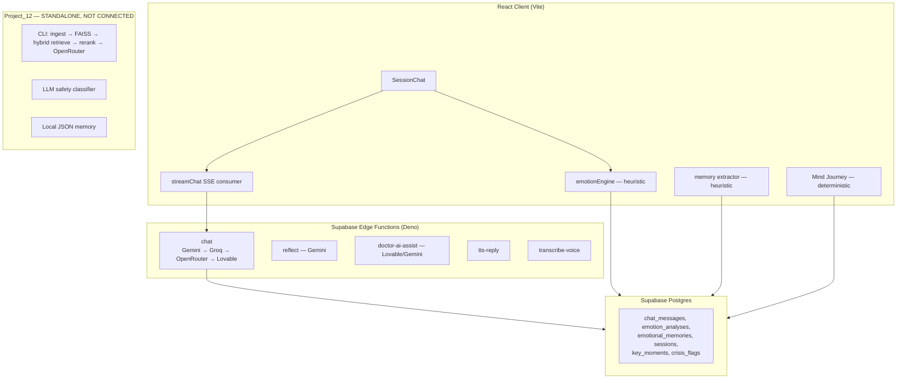
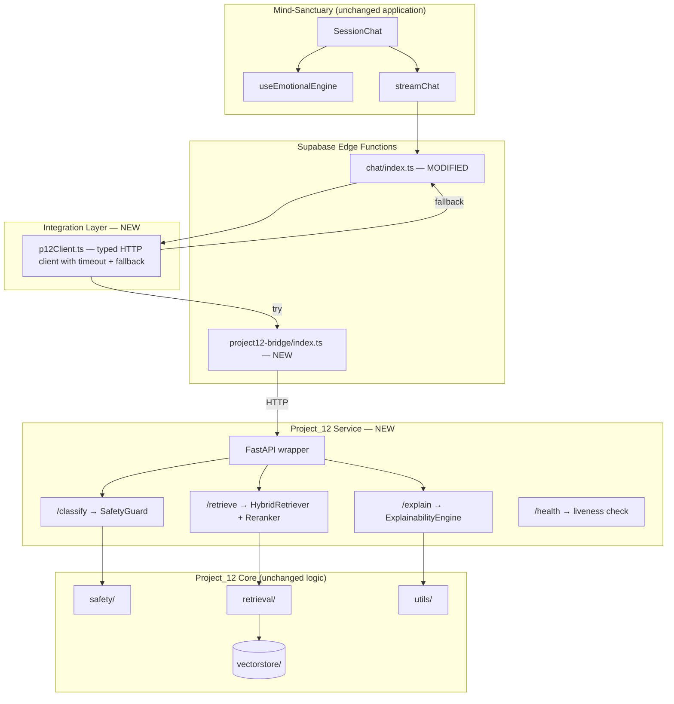
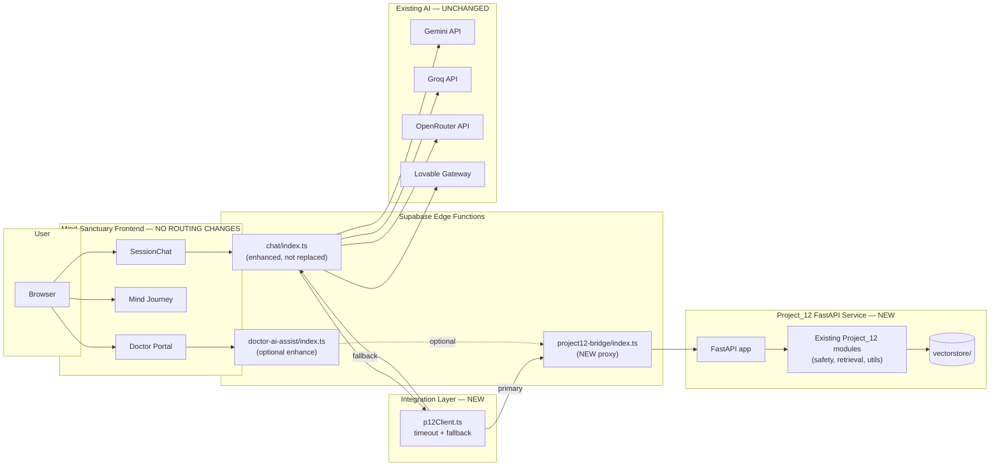

# AI Integration Plan — Project_12 → Mind-Sanctuary

**Date:** 2026-06-08  
**Status:** Planning complete — **implementation not started**  
**Prerequisite:** [AI_INTEGRATION_AUDIT.md](./AI_INTEGRATION_AUDIT.md)

---

## Integration Principles

| Rule | Detail |
|------|--------|
| Project_12 role | **Service/provider only** — no new application |
| Mind-Sanctuary role | **Primary application** — unchanged architecture |
| Existing AI | Must continue working |
| Existing APIs | Must continue working |
| Existing chat | Must continue working |
| Fallback chain | Project_12 → Existing AI Pipeline → Safe Fallback |
| Forbidden | Auth changes, onboarding changes, recovery changes, therapist portal changes, dashboard architecture changes, database schema changes (unless absolutely required), routing changes, destructive refactors |

---

## Current Mind-Sanctuary AI Landscape



### Current AI capabilities summary

| Feature | Implementation | Real LLM? |
|---------|----------------|-----------|
| AI chat | Supabase edge `chat/index.ts`, multi-provider failover | Yes |
| Emotion analysis | `emotionEngine.ts` — keyword/heuristic | No |
| Crisis (chat) | `detectCrisis()` keywords + `assessCrisis()` levels | No |
| Therapeutic memory | `memory/extractor.ts` — regex/heuristic | No |
| Mind Journey | `mindJourney/*` — deterministic analytics | No |
| Future self simulator | `buildFutureSelf.ts` — rule-based projection | No |
| Therapist intelligence | Static demo cohort + partial `doctor-ai-assist` | Partial |
| Voice | Gemini paraphrase + Munsit/ElevenLabs | Partial |

---

## Phase 2 — Feature Mapping

### 1. AI Chat

| | Detail |
|---|--------|
| **Current source** | `Mind-Sanctuary-main/src/components/SessionChat.tsx` → `streamChat.ts` → `supabase/functions/chat/index.ts` |
| **Current behavior** | General-purpose LLM with personalized system prompt (emotion state, recalled memories, crisis notes, personality). No clinical corpus grounding. Provider chain: Gemini → Groq → OpenRouter → Lovable. |
| **Project_12 enhancement** | Inject RAG-retrieved psychiatric context (top-7 reranked chunks from PDF library) into system prompt via hybrid BM25 + FAISS + cross-encoder pipeline. Add source citations and explainability trace. |
| **Expected gain** | Evidence-based, citation-backed therapeutic responses grounded in psychiatric reference material. Reduced hallucination on clinical topics. Transparent retrieval provenance for clinicians. |
| **Integration hook** | Pre-generation call to Project_12 `/retrieve` endpoint; append `{context}` + `{sources}` to `buildPersonalizedSystemPrompt()` output in `chat/index.ts`. |
| **Fallback** | If retrieval fails or times out, existing chat pipeline runs unchanged. |

---

### 2. Emotional Analysis

| | Detail |
|---|--------|
| **Current source** | `Mind-Sanctuary-main/src/lib/emotionEngine.ts`, `src/hooks/useEmotionalEngine.ts` |
| **Current behavior** | Keyword matching for emotions (`calm`, `mild stress`, `moderate anxiety`, etc.). Distortion patterns (rumination, self-blame). Simple positive/negative sentiment counts. Results persisted to `emotion_analyses` and fed into chat system prompt. |
| **Project_12 enhancement** | Project_12 does **not** have a dedicated emotion classifier. Indirect enhancement: RAG context may improve LLM's emotional attunement in responses. SafetyGuard's `CRISIS_DISTRESS` category overlaps with high-intensity emotional states. |
| **Expected gain** | **Low direct gain** — Project_12 has no emotion model. Marginal improvement via better-grounded empathetic responses. Consider keeping existing heuristic engine as primary; optionally use SafetyGuard distress signal as supplementary input to emotion intensity. |
| **Integration hook** | Optional: map `CRISIS_DISTRESS` from SafetyGuard to elevate `assessCrisis()` level in `useEmotionalEngine.prepareTurn()`. |
| **Fallback** | Existing `analyzeEmotion()` always runs first; Project_12 signal is additive only. |

---

### 3. Crisis Prediction

| | Detail |
|---|--------|
| **Current source** | **Immediate:** `emotionEngine.ts` `detectCrisis()` (hard keyword block) + `crisis/awareness.ts` `assessCrisis()` (soft/elevated/acute levels). **Longitudinal:** `mindJourney/buildEarlyRisk.ts`, `buildCrisisPrevention.ts` (heuristic scoring). **Clinician:** `doctor/CrisisQueue.tsx`, `doctor/crisis.ts`. |
| **Current behavior** | Keyword lists block AI and show crisis UI. Soft crisis notes injected into system prompt. Mind Journey uses wellness slopes, session gaps, anxiety share — no ML. |
| **Project_12 enhancement** | `SafetyGuard` LLM classifier with 4 categories (`SAFE`, `SUICIDE_RISK`, `SELF_HARM`, `CRISIS_DISTRESS`) + `CrisisHandler` template responses. More nuanced than keyword matching; catches paraphrased/indirect crisis language. |
| **Expected gain** | **High gain** for real-time crisis detection. Fewer false negatives on indirect suicide/self-harm language. Structured crisis categories enable tiered response (template + LLM softening). |
| **Integration hook** | Call Project_12 `/classify` before LLM in chat flow. Map categories: `SUICIDE_RISK`/`SELF_HARM` → existing `detectCrisis()` behavior; `CRISIS_DISTRESS` → `assessCrisis()` elevated level. Prepend `CrisisHandler` templates to system addenda. |
| **Fallback** | Keyword `detectCrisis()` remains as fast first-pass (zero latency). Project_12 classifier runs in parallel or as second pass; if unavailable, keywords alone govern behavior. |

---

### 4. Therapeutic Memory

| | Detail |
|---|--------|
| **Current source** | `Mind-Sanctuary-main/src/lib/memory/extractor.ts`, `store.ts`, `recall.ts`. Supabase `emotional_memories` table. |
| **Current behavior** | Regex/heuristic extraction of goals, fears, triggers, people, themes. Explicitly designed *"to be augmented by an AI pass later."* Recall scores top 6 memories for chat injection. |
| **Project_12 enhancement** | `MemoryManager` tracks `reported_concerns` and `important_notes` per patient, injected into RAG context. Pattern for longitudinal concern accumulation. |
| **Expected gain** | **Medium gain.** Project_12's concern/note pattern can enrich memory extraction. RAG context injection of user profile mirrors existing `recallForChat()` but with concern-level granularity. Future: LLM-based structured extraction replacing regex. |
| **Integration hook** | Map Supabase `emotional_memories` → Project_12 profile context for retrieval. Optionally augment `extractMemories()` output with Project_12 `add_concern()` logic. **Do not replace** Supabase memory store — Project_12 memory is ephemeral context only. |
| **Fallback** | Existing `extractMemories()` + `recallForChat()` unchanged if Project_12 unavailable. |

---

### 5. Future Self Simulator

| | Detail |
|---|--------|
| **Current source** | `Mind-Sanctuary-main/src/lib/mindJourney/buildFutureSelf.ts`, `predictionModel.ts`, `simulateFuturePaths.ts` |
| **Current behavior** | Deterministic math: `extractBaselineSignals()` from wellness scores → three paths (`continue`, `growth`, `neglect`) with fixed multipliers → `projectHorizon()` at 30/90/180 days. No LLM. |
| **Project_12 enhancement** | **Minimal direct fit.** Project_12 has no predictive modeling. Indirect: RAG could generate narrative future-self scenarios grounded in psychiatric literature (e.g., progression patterns for conditions). |
| **Expected gain** | **Low near-term gain.** Possible future enhancement: LLM-generated narrative overlays on deterministic projections using RAG context about condition trajectories. |
| **Integration hook** | Deferred to Phase 2+. Keep deterministic engine as primary. |
| **Fallback** | N/A — no changes to future self simulator in initial integration. |

---

### 6. Mind Journey

| | Detail |
|---|--------|
| **Current source** | `Mind-Sanctuary-main/src/lib/mindJourney/` (54 files), `loadMindJourney.ts`, `useMindJourney.ts` |
| **Current behavior** | Client-side aggregation of sessions, emotion analyses, activity sessions, key moments. Computes metrics, story chapters, early risk, crisis prevention, therapeutic memory, personality twin, emotional forecast — all deterministic. |
| **Project_12 enhancement** | SafetyGuard distress signals could feed `buildEarlyRisk.ts`. RAG explainability could enrich insight narratives. Embedding-based theme clustering (using Project_12's `all-MiniLM-L6-v2`) could improve pattern detection across sessions. |
| **Expected gain** | **Medium gain** for risk scoring enrichment. Embedding clustering could surface thematic patterns invisible to keyword heuristics. |
| **Integration hook** | Post-process hook: pass aggregated session text to Project_12 `/classify` for batch distress scoring. Feed results into `buildEarlyRisk` / `buildCrisisPrevention` as supplementary signals. |
| **Fallback** | Mind Journey runs fully without Project_12; enrichment is optional overlay. |

---

### 7. Therapist Intelligence Dashboard

| | Detail |
|---|--------|
| **Current source** | **Demo:** `therapistIntelligence/TherapistIntelligenceDemo.tsx` + `buildDemoCohort.ts` (static fake data). **Live:** `doctor/ClinicianInsights.tsx` (scaffold), `doctor/CrisisQueue.tsx`, `doctor/AIAssistPanel.tsx`, `supabase/functions/doctor-ai-assist/index.ts`. |
| **Current behavior** | Demo dashboard shows hardcoded cohort. Doctor portal has crisis queue (live) and AI activity suggestions. `summarize_patient_trends` and `suggest_followups` modes exist server-side but have **no UI caller**. |
| **Project_12 enhancement** | `ExplainabilityEngine` provides retrieval traces and source citations. QA logs (`qa_store.py`) pattern for patient interaction audit. RAGAS evaluation pipeline for answer quality metrics. RAG context for evidence-based clinician summaries. |
| **Expected gain** | **High gain** for clinician trust and transparency. Source citations, retrieval explanations, and structured QA logs replace static demo data with real intelligence. Wire existing `summarize_patient_trends` to Project_12 retrieval + explainability. |
| **Integration hook** | New edge function or extend `doctor-ai-assist` to call Project_12 `/explain` + `/retrieve` for patient session summaries. Surface citations in `ClinicianInsights.tsx`. |
| **Fallback** | Demo dashboard and existing `doctor-ai-assist` activity modes unchanged. Enhancement is additive panel. |

---

## Phase 3 — Safe Integration Design

### Fallback Strategy

```
User message arrives
        │
        ▼
┌─────────────────────────┐
│ 1. Fast keyword crisis   │  ← Existing detectCrisis() (0ms, always runs)
│    check (existing)      │
└───────────┬─────────────┘
            │ not blocked
            ▼
┌─────────────────────────┐
│ 2. Project_12 classify   │  ← SafetyGuard LLM classifier
│    + retrieve context    │  ← Hybrid RAG pipeline
└───────────┬─────────────┘
            │ success → inject context + safety notes
            │ failure/timeout (3s) ↓
            ▼
┌─────────────────────────┐
│ 3. Existing AI pipeline  │  ← chat/index.ts provider chain
│    (unchanged)           │     Gemini → Groq → OpenRouter → Lovable
└───────────┬─────────────┘
            │ all providers fail
            ▼
┌─────────────────────────┐
│ 4. Safe fallback         │  ← Existing fallback responses
│    (existing behavior)   │     { fallback: true } + Dr. Sentinel prompt
└─────────────────────────┘
```

### Integration Layer Architecture



### Project_12 Service Endpoints (proposed)

| Endpoint | Method | Input | Output | Timeout |
|----------|--------|-------|--------|---------|
| `/health` | GET | — | `{ status: "ok", models_loaded: bool }` | 1s |
| `/classify` | POST | `{ text: string }` | `{ category: string, confidence?: string }` | 3s |
| `/retrieve` | POST | `{ query: string, top_k?: number }` | `{ chunks: [{content, source, page}], context: string }` | 5s |
| `/explain` | POST | `{ query: string, top_k?: number }` | `{ explanation: string, sources: string[] }` | 5s |

### Environment Variables (new)

| Variable | Location | Purpose |
|----------|----------|---------|
| `PROJECT12_SERVICE_URL` | Edge function env | Base URL for Project_12 service |
| `PROJECT12_ENABLED` | Edge function env | Feature flag (`true`/`false`) |
| `PROJECT12_TIMEOUT_MS` | Edge function env | Per-call timeout (default: 3000) |
| `OPENROUTER_API_KEY` | Project_12 service | Already required by Project_12 |

---

## Phase 4 — Pre-Implementation Validation

### 1. Architecture Diagram (Target State)



### 2. Files to Create

| File | Purpose |
|------|---------|
| `Project_12/service/app.py` | FastAPI application wrapping inference logic |
| `Project_12/service/routes.py` | `/health`, `/classify`, `/retrieve`, `/explain` endpoints |
| `Project_12/service/models.py` | Pydantic request/response schemas |
| `Project_12/service/loader.py` | Singleton model/vectorstore loader (lazy init) |
| `Project_12/service/requirements.txt` | FastAPI, uvicorn + existing deps |
| `Project_12/service/Dockerfile` | Container for deployment |
| `Mind-Sanctuary-main/supabase/functions/project12-bridge/index.ts` | Deno proxy to Project_12 service with auth |
| `Mind-Sanctuary-main/supabase/functions/_shared/p12Client.ts` | Typed client with timeout, retry, fallback |
| `Mind-Sanctuary-main/supabase/functions/_shared/p12Types.ts` | Shared TypeScript types for Project_12 responses |

### 3. Files to Modify

| File | Change | Risk |
|------|--------|------|
| `Mind-Sanctuary-main/supabase/functions/chat/index.ts` | Import `p12Client`; pre-process: classify + retrieve; inject context into system prompt | **Medium** — must not break existing provider chain |
| `Mind-Sanctuary-main/supabase/functions/_shared/promptPersonalization.ts` | Add optional `ragContext` and `safetyCategory` parameters | **Low** — additive only |
| `Project_12/memory/profile_store.py` | Fix hardcoded `F:\Education\...` path to relative `memory_data/` | **Low** — standalone fix |
| `Project_12/memory/chat_store.py` | Fix hardcoded path | **Low** — standalone fix |
| `Project_12/config.py` | Add `PROJECT12_SERVICE_HOST`, `PROJECT12_SERVICE_PORT` | **Low** |
| `Mind-Sanctuary-main/supabase/functions/doctor-ai-assist/index.ts` | Optional: call `/explain` for patient summaries | **Low** — existing modes unchanged |

### 4. Files NOT to Modify

| Area | Files | Reason |
|------|-------|--------|
| Authentication | All auth-related files | Explicit constraint |
| Onboarding | Onboarding flows | Explicit constraint |
| Recovery system | Recovery components | Explicit constraint |
| Therapist portal structure | `DoctorPortal.tsx`, routing | Explicit constraint |
| Dashboard architecture | `Dashboard.tsx` structure | Explicit constraint |
| Database schema | Supabase migrations | No schema changes needed |
| Frontend routing | React Router config | Explicit constraint |
| Client chat UI | `SessionChat.tsx` | Changes are server-side only |
| Emotion engine | `emotionEngine.ts` | Existing heuristics remain primary |
| Mind Journey core | `mindJourney/*` builders | No changes in Phase 1 integration |

### 5. Risks

| # | Risk | Severity | Mitigation |
|---|------|----------|------------|
| R1 | Project_12 service downtime breaks chat | **Critical** | Fallback chain: P12 failure → existing chat unchanged. Feature flag `PROJECT12_ENABLED=false` killswitch. |
| R2 | Project_12 latency adds perceptible delay | **High** | 3s timeout on classify/retrieve. Run classify in parallel with emotion analysis. Retrieve only when message suggests informational query. |
| R3 | OpenRouter rate limits / costs double | **Medium** | Project_12 service uses same `OPENROUTER_API_KEY`. Classify is lightweight (single label). Monitor usage. |
| R4 | FAISS vectorstore not deployed with service | **High** | Include `vectorstore/` in Docker image or mount volume. Document `ingest.py` in deployment pipeline. |
| R5 | HuggingFace model download on cold start | **Medium** | Pre-download models in Docker build. Health check waits for model load. |
| R6 | Hardcoded paths in Project_12 memory stores | **Low** | Fix before service wrapper (pre-integration blocker #2). |
| R7 | Safety classifier false positives block normal chat | **High** | Never hard-block on Project_12 classify alone. Use as supplementary signal; keyword `detectCrisis()` remains authoritative for blocking. |
| R8 | RAG context overwhelms system prompt token limit | **Medium** | Cap retrieved context at 2000 tokens. Top-3 chunks instead of top-7 for chat integration. |
| R9 | `.env` API key exposure | **Medium** | Rotate key. Add `.env` to `.gitignore`. Use secrets manager in deployment. |
| R10 | Deno edge function calling Python service adds network hop | **Low** | Deploy Project_12 service in same region/network as Supabase. Bridge function is thin proxy. |

### 6. Rollback Plan

| Step | Action | Time |
|------|--------|------|
| 1 | Set `PROJECT12_ENABLED=false` in Supabase edge function environment | Immediate (< 1 min) |
| 2 | Chat reverts to existing behavior — no code deploy needed | Immediate |
| 3 | If bridge function causes errors: remove `p12Client` import from `chat/index.ts` (revert commit) | < 5 min deploy |
| 4 | Stop Project_12 service container | < 1 min |
| 5 | Full rollback: revert integration commits on edge functions only. Frontend and database untouched. | < 10 min |

**Rollback guarantees:**
- No database migrations to reverse
- No frontend changes to revert
- No auth changes to reverse
- Feature flag provides instant disable without deployment
- Existing provider chain is never removed, only optionally preceded by Project_12

---

## Implementation Phases (Ordered)

### Phase A — Project_12 Service Foundation (no Mind-Sanctuary changes)

1. Fix hardcoded paths in `profile_store.py`, `chat_store.py`
2. Run `ingest.py` to generate `vectorstore/`
3. Create FastAPI service wrapping classify, retrieve, explain
4. Add `/health` endpoint with model load status
5. Dockerize with pre-downloaded models + vectorstore
6. Verify standalone with curl/httpx tests

### Phase B — Integration Layer (edge functions only)

1. Create `p12Client.ts` with timeout + fallback
2. Create `project12-bridge/index.ts` proxy
3. Add `PROJECT12_ENABLED` feature flag (default: `false`)
4. Modify `chat/index.ts` to optionally call Project_12 before provider chain
5. Extend `promptPersonalization.ts` with `ragContext` parameter
6. Deploy with flag off; verify existing chat unchanged

### Phase C — Enable and Validate

1. Set `PROJECT12_ENABLED=true` in staging
2. Test: normal chat, crisis messages, retrieval quality, fallback on service down
3. Monitor latency and error rates
4. Enable in production with flag

### Phase D — Extended Enhancements (future)

1. Wire `doctor-ai-assist` to `/explain` for clinician summaries
2. Batch classify for Mind Journey risk enrichment
3. LLM-based memory extraction augmenting `extractMemories()`
4. RAGAS evaluation in CI pipeline

---

## Priority Matrix

| Feature | Priority | Effort | Gain | Phase |
|---------|----------|--------|------|-------|
| Crisis classification (SafetyGuard) | **P0** | Medium | High | B |
| RAG context injection (chat) | **P0** | Medium | High | B |
| Fallback infrastructure | **P0** | Low | Critical | B |
| FastAPI service wrapper | **P0** | Medium | Prerequisite | A |
| Explainability (clinician) | **P1** | Low | High | D |
| Therapeutic memory enrichment | **P2** | Medium | Medium | D |
| Mind Journey risk signals | **P2** | Medium | Medium | D |
| Future self narrative overlay | **P3** | High | Low | Deferred |
| Emotion analysis replacement | **P3** | High | Low | Deferred |

---

## Success Criteria

- [ ] Mind-Sanctuary chat works identically with `PROJECT12_ENABLED=false`
- [ ] Mind-Sanctuary chat works with enhanced context when `PROJECT12_ENABLED=true`
- [ ] Project_12 service failure does not break chat (fallback verified)
- [ ] Crisis detection: keyword block still works; SafetyGuard adds supplementary signal
- [ ] No changes to auth, onboarding, recovery, therapist portal, dashboard architecture
- [ ] No database schema changes
- [ ] Latency increase < 500ms p95 when Project_12 enabled
- [ ] Rollback via feature flag verified in < 1 minute

---

## Next Step

**Awaiting approval to proceed with Phase A implementation** (Project_12 service foundation only, no Mind-Sanctuary changes).

Review this plan and confirm:
1. Priority order is acceptable
2. Feature flag approach is acceptable
3. FastAPI service deployment target (Docker, cloud provider preference)
4. Whether to proceed with Phase A
