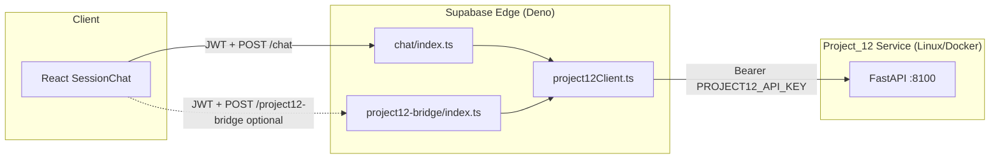

# Cloud Deployment Checklist — Project_12 + Supabase Edge

**Date:** 2026-06-08  
**Scope:** `project12-bridge`, `chat` augmentation, Supabase secrets, API requirements  
**Mind-Sanctuary app code:** Not modified  
**B.4 / B.5:** Not started

---

## 1. Architecture Overview



---

## 2. Current Deployment Status

| Component | Cloud status | Evidence |
|-----------|--------------|----------|
| `chat` edge function | **Deployed** | `POST /functions/v1/chat` → HTTP 401 without JWT |
| `project12-bridge` | **NOT deployed** | `POST /functions/v1/project12-bridge` → HTTP 404 |
| Project_12 FastAPI | **Not cloud-hosted** | No public `PROJECT12_SERVICE_URL` configured |
| `PROJECT12_ENABLED` on edge | **false** (default) | Production unchanged |

---

## 3. project12-bridge Audit

**File:** `supabase/functions/project12-bridge/index.ts`

| Check | Status | Detail |
|-------|--------|--------|
| Auth | ✅ | `requireAuth()` — JWT required |
| Modes | ✅ | `retrieve`, `crisis_detection`, `memory_search` |
| Body limit | ✅ | 8 KB max |
| Text/query limit | ✅ | 4000 chars |
| API key exposure | ✅ | `PROJECT12_API_KEY` server-side only |
| Logging | ✅ | No message content in logs |
| Fallback | ✅ | Always HTTP 200 with `fallback: true` on errors |
| Kill switch | ✅ | `PROJECT12_ENABLED=false` → immediate disabled fallback |
| Response headers | ✅ | `X-Project12-Fallback`, `X-Project12-Mode` |
| Frontend wired | ⚠️ | No React caller yet (B.2 design) |

### Bridge request example

```http
POST https://<project>.supabase.co/functions/v1/project12-bridge
Authorization: Bearer <user_jwt>
apikey: <supabase_anon_key>
Content-Type: application/json

{"mode": "retrieve", "query": "symptoms of anxiety", "top_k": 7}
```

### Bridge success response

```json
{
  "fallback": false,
  "mode": "retrieve",
  "data": { "query": "...", "context": "...", "sources": [], "chunk_count": 7 },
  "cached": false,
  "latency_ms": 340
}
```

---

## 4. chat Augmentation Audit (B.3)

**File:** `supabase/functions/chat/index.ts`

| Check | Status |
|-------|--------|
| Calls `fetchChatAugmentation` pre-stream | ✅ |
| Skips in interview mode | ✅ |
| Sets `X-Project12-Augmented` header | ✅ |
| Sets `X-Project12-Retrieval-Cached` header | ✅ |
| Provider chain unchanged | ✅ |
| P12 failure never returns 500 | ✅ |

---

## 5. Supabase Deployment Requirements

### 5.1 Functions to deploy

```bash
cd Mind-Sanctuary-main
supabase functions deploy chat
supabase functions deploy project12-bridge
```

`supabase/config.toml` already defines:

```toml
[functions.chat]
verify_jwt = true

[functions.project12-bridge]
verify_jwt = true
```

### 5.2 Edge function secrets (staging)

Set via Supabase Dashboard → Edge Functions → Secrets, or CLI:

```bash
supabase secrets set PROJECT12_ENABLED=true
supabase secrets set PROJECT12_SERVICE_URL=https://<your-p12-host>:8100
supabase secrets set PROJECT12_API_KEY=<shared-secret-min-16-chars>
supabase secrets set PROJECT12_TIMEOUT_MS=1200
supabase secrets set PROJECT12_CACHE_TTL_MS=300000
```

**Also required for chat streaming (existing):**

```bash
supabase secrets set OPENROUTER_API_KEY=<key>
# Optional: GEMINI_API_KEY, GROQ_API_KEY, LOVABLE_API_KEY
supabase secrets set SUPABASE_URL=https://<project>.supabase.co
supabase secrets set SUPABASE_ANON_KEY=<anon_key>
```

### 5.3 Production secrets policy

| Secret | Staging | Production |
|--------|---------|------------|
| `PROJECT12_ENABLED` | `true` | **`false`** until sign-off |
| `PROJECT12_SERVICE_URL` | Public HTTPS URL to P12 | Same |
| `PROJECT12_API_KEY` | Shared with P12 service | Same |

---

## 6. API Key Requirements

### 6.1 `PROJECT12_API_KEY` (service-to-service)

| Rule | Value |
|------|-------|
| Minimum length | **16 characters** |
| Edge validation | `isProject12Configured()` in `project12Client.ts` |
| Service validation | `service/security/auth.py` — Bearer token |
| Must match | **Identical** on Supabase edge AND Project_12 `.env` |
| Client exposure | **Never** — not in React `.env` |

### 6.2 `OPENROUTER_API_KEY`

| Used by | Purpose |
|---------|---------|
| Project_12 `/chat`, `/crisis-detection` | LLM inference |
| Supabase `chat` edge | Provider chain fallback |

Can be same or different keys per service.

### 6.3 Supabase JWT / anon key

| Key | Used by |
|-----|---------|
| User JWT | `requireAuth()` on bridge + chat |
| `SUPABASE_ANON_KEY` | Edge `createClient` for JWT validation |

---

## 7. Network Requirements

| From | To | Requirement |
|------|-----|-------------|
| Supabase Edge (Deno) | Project_12 `:8100` | **Public HTTPS** or private network peering |
| Internet users | Supabase Edge | Standard Supabase URL |
| Project_12 | OpenRouter API | Outbound HTTPS |

### Critical constraint

`PROJECT12_SERVICE_URL` **cannot** be `http://127.0.0.1:8100` on cloud edge — must be a URL reachable from Supabase's edge runtime (e.g. Cloud Run, Railway, Fly.io, VPS with TLS).

Recommended URL format:

```
https://project12.<your-domain>.com
```

---

## 8. Project_12 Cloud Hosting Checklist

| Step | Action |
|------|--------|
| 1 | Deploy Project_12 via Docker on Linux (see `LINUX_DEPLOYMENT_VALIDATION.md`) |
| 2 | Set `PROJECT12_API_KEY` in container `.env` |
| 3 | Set `OPENROUTER_API_KEY` in container `.env` |
| 4 | Expose port 8100 behind HTTPS reverse proxy |
| 5 | Verify `GET /health` → 200 |
| 6 | Verify `GET /ready` → `"ready": true` (after model load) |
| 7 | Test `POST /retrieve` with Bearer token |
| 8 | Test `POST /crisis-detection` with Arabic + English crisis text |
| 9 | Allocate ≥4 GB RAM |
| 10 | Configure firewall: allow Supabase edge egress IPs only (optional hardening) |

---

## 9. End-to-End Cloud Validation Steps

After deployment:

| # | Test | Expected |
|---|------|----------|
| 1 | Bridge without JWT | HTTP 401 |
| 2 | Bridge with JWT, P12 disabled | `fallback: true`, `reason: project12_disabled` |
| 3 | Bridge with JWT, P12 enabled | `fallback: false`, retrieval data |
| 4 | Chat with JWT, P12 OFF | `X-Project12-Augmented: false` |
| 5 | Chat with JWT, P12 ON | `X-Project12-Augmented: true` |
| 6 | Arabic crisis message | Crisis metadata in augmentation; P12 `/crisis-detection` → non-SAFE |
| 7 | P12 service down | Chat still streams; `X-Project12-Augmented: false` |

---

## 10. Remaining Cloud Blockers

| ID | Blocker | Owner | Status |
|----|---------|-------|--------|
| CB1 | `project12-bridge` not deployed to Supabase | Ops | **Open** |
| CB2 | No public Project_12 host | Ops | **Open** |
| CB3 | Edge secrets not set for staging | Ops | **Open** |
| CB4 | `PROJECT12_SERVICE_URL` must be cloud-reachable | Ops | **Open** |
| CB5 | Windows torch blocks local P12 — use Linux Docker | Infra | Documented |
| CB6 | Arabic crisis heuristic | Project_12 | **Closed** |

---

## 11. Rollback Plan

| Action | Effect |
|--------|--------|
| `supabase secrets set PROJECT12_ENABLED=false` | Immediate disable — zero chat behavior change |
| Undeploy `project12-bridge` | Bridge 404 — no impact if frontend doesn't call it |
| Stop Project_12 container | Chat falls back silently (augmentation skipped) |

---

## 12. Final Recommendation

| Priority | Action |
|----------|--------|
| P0 | Deploy Project_12 on Linux/Docker with public HTTPS URL |
| P0 | `supabase functions deploy project12-bridge` |
| P1 | Set staging edge secrets (`PROJECT12_ENABLED=true` staging only) |
| P1 | Run cloud E2E matrix (§9) |
| P2 | Keep production `PROJECT12_ENABLED=false` until staging sign-off |
| — | **Do not start B.4 or B.5** until cloud blockers CB1–CB4 closed |

**Cloud deployment readiness: CODE READY — INFRASTRUCTURE PENDING.**
