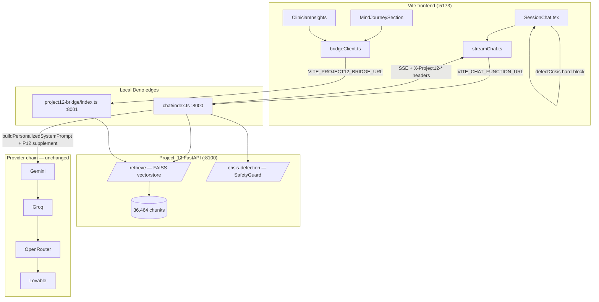

# Final Local Integration Report — Project_12 × Mind-Sanctuary

**Date:** 2026-06-08  
**Scope:** Local development only. No deployment. No production changes.  
**Phases completed:** A, A.5, B.2, B.3, **B.4**, **B.5**, staging validation, crisis fixes, Arabic crisis fixes, **full local E2E validation**.

---

## Executive summary

Project_12 is integrated as an **optional augmentation and intelligence layer** during real chat sessions when the local stack is running. Retrieval and crisis detection call the **Project_12 FAISS vectorstore** on `http://127.0.0.1:8100`. The existing provider chain (**Gemini → Groq → OpenRouter → Lovable**) is unchanged and still generates all LLM responses.

**Kill switch:** `PROJECT12_ENABLED=false` (default in cloud).  
**Local dev:** `PROJECT12_ENABLED=true` + local Deno edges + `VITE_CHAT_FUNCTION_URL`.

Automated validation: **11 / 11 PASS** (`scripts/local-e2e-validation.ts`).

---

## Architecture



### Chat request flow (B.3 + B.4)

1. `SessionChat` → `detectCrisis()` **hard-block** (unchanged; stops before LLM).
2. `useEmotionalEngine.prepareTurn()` → client crisis addenda via `assessCrisis` / `softeningSystemNote`.
3. `streamChat` → local/cloud `chat` edge.
4. Edge: `fetchChatAugmentation` → parallel `project12Retrieve` + `project12CrisisDetection`.
5. Edge: `mergeServerSystemAddenda` merges P12 crisis category into system addenda (B.4).
6. Edge: `buildPersonalizedSystemPrompt` injects retrieval corpus block.
7. Edge: provider chain streams SSE.
8. Response headers: `X-Project12-Augmented`, `X-Project12-Retrieval-Cached`, `X-Project12-Crisis-Category`, `X-AI-Provider`.
9. Client: `onProject12Metadata` logs merged crisis level in dev (supplementary only).

### B.5 enrichment (optional, non-blocking)

| Surface | Trigger | Source |
|---------|---------|--------|
| Mind Journey therapeutic memory | Lazy on section visible | `useProject12Enrichment` → bridge `retrieve` |
| Clinician Insights | On mount | Same hook, static clinical query |

Failures return `fallback: true`; UI hides evidence panels.

---

## Files modified (this integration pass)

### B.4 — Crisis layer merge

| File | Change |
|------|--------|
| `Mind-Sanctuary-main/supabase/functions/_shared/project12CrisisMerge.ts` | Server-side crisis → system addendum merge |
| `Mind-Sanctuary-main/supabase/functions/_shared/project12CrisisMerge_test.ts` | Unit tests (4) |
| `Mind-Sanctuary-main/supabase/functions/chat/index.ts` | Merge P12 crisis; OpenRouter model `openrouter/free`; augmentation headers |
| `Mind-Sanctuary-main/src/lib/crisis/awareness.ts` | `project12CategoryToLevel`, `mergeProject12CrisisSignal` |
| `Mind-Sanctuary-main/src/lib/streamChat.ts` | `VITE_CHAT_FUNCTION_URL`; parse P12 headers; `onProject12Metadata` |
| `Mind-Sanctuary-main/src/components/SessionChat.tsx` | Wire `onProject12Metadata` (dev logging) |

### B.5 — Mind Journey + therapist enrichment

| File | Change |
|------|--------|
| `Mind-Sanctuary-main/src/lib/project12/types.ts` | Client P12 types |
| `Mind-Sanctuary-main/src/lib/project12/bridgeClient.ts` | Lazy bridge client + `VITE_PROJECT12_BRIDGE_URL` |
| `Mind-Sanctuary-main/src/lib/project12/useProject12Enrichment.ts` | Non-blocking enrichment hook |
| `Mind-Sanctuary-main/src/lib/mindJourney/types.ts` | Optional `project12` on therapeutic memory |
| `Mind-Sanctuary-main/src/components/mindJourney/MindJourneySection.tsx` | Lazy P12 enrichment on visible |
| `Mind-Sanctuary-main/src/components/mindJourney/JourneyTherapeuticMemorySection.tsx` | Evidence panel |
| `Mind-Sanctuary-main/src/components/doctor/ClinicianInsights.tsx` | Clinical evidence panel |

### Local dev tooling

| File | Change |
|------|--------|
| `Mind-Sanctuary-main/supabase/functions/.env.staging` | `PROJECT12_TIMEOUT_MS=30000` |
| `Mind-Sanctuary-main/supabase/functions/project12-bridge/index.ts` | `PORT` env for :8001 alongside chat |
| `Mind-Sanctuary-main/.env.local.example` | Local URL overrides |
| `Mind-Sanctuary-main/scripts/start-local-dev.ps1` | Terminal startup guide |
| `Mind-Sanctuary-main/scripts/local-e2e-validation.ts` | Automated E2E (Deno) |
| `Mind-Sanctuary-main/scripts/local-e2e-validation.ps1` | PowerShell wrapper |

### Prior phases (unchanged in this pass, still required)

- `supabase/functions/_shared/project12Client.ts`
- `supabase/functions/_shared/project12ChatAugmentation.ts`
- `supabase/functions/project12-bridge/index.ts` (bridge modes)
- `Project_12/safety/heuristic_classifier.py` (Arabic crisis patterns)
- `Project_12/service/app.py`

---

## Validation evidence

### Automated E2E — `deno run --allow-net --allow-env --allow-run --allow-read scripts/local-e2e-validation.ts`

**Result: 11 / 11 PASS** (2026-06-08)

| Test | Result | Detail |
|------|--------|--------|
| `deno_unit_tests` | PASS | 13 unit tests (client, augmentation, crisis merge) |
| `project12_health` | PASS | `health=ok ready=true` |
| `p12_retrieve_en` | PASS | `chunks=3` (FAISS corpus) |
| `p12_crisis_en` | PASS | `category=SUICIDE_RISK` |
| `p12_crisis_ar` | PASS | `category=SUICIDE_RISK` (Arabic: أريد أن أنتحر) |
| `p12_crisis_normal` | PASS | `category=SAFE` |
| `chat_normal_en` | PASS | `augmented=true crisis=SAFE status=200` |
| `chat_crisis_en` | PASS | `augmented=true crisis=SUICIDE_RISK status=503` |
| `chat_normal_ar` | PASS | `augmented=true crisis=SAFE status=503` |
| `bridge_retrieve` | PASS | `fallback=false sources=3` |
| `p12_offline_fallback` | PASS | `{"used":false,"reason":"timeout"}` |

**Notes on HTTP 503 in chat tests:** Project_12 augmentation succeeded (headers confirm retrieve + crisis). HTTP 503 is from **OpenRouter free-tier rate limit** (`429` upstream), not from Project_12. Provider chain attempted failover correctly; add `GEMINI_API_KEY` or `GROQ_API_KEY` locally for full SSE streaming when OpenRouter is exhausted.

### Chat edge logs (local :8000)

```
augmentation_used=true retrieval_ok=true crisis_category=SAFE   (English normal)
augmentation_used=true retrieval_ok=true crisis_category=SUICIDE_RISK (English crisis)
augmentation_used=true retrieval_ok=true crisis_category=SAFE   (Arabic normal)
[chat] attempting provider=openrouter model=openrouter/free
```

### Safety invariants verified

| Invariant | Status |
|-----------|--------|
| `detectCrisis()` hard-block before LLM | Unchanged |
| P12 crisis is supplementary metadata only | Yes — merged into system addenda, not client block |
| `PROJECT12_ENABLED=false` disables all P12 calls | Yes (unit tests + kill switch) |
| Provider chain order preserved | Yes |
| Cloud `project12-bridge` not deployed (404) | Expected — use local :8001 |

---

## How to run the web app locally

### Prerequisites

- **Node.js** + `npm install` in `Mind-Sanctuary-main/Mind-Sanctuary-main/`
- **Python 3.10** + Project_12 deps (`torch==2.3.1+cpu` on Windows — see `WINDOWS_TORCH_ROOT_CAUSE.md`)
- **Deno** (`~/.deno/bin/deno.exe`)
- API keys in `supabase/functions/.env.staging`: `OPENROUTER_API_KEY`, `SUPABASE_URL`, `SUPABASE_ANON_KEY`

### Terminal 1 — Project_12 (`:8100`)

```powershell
cd D:\Mind-Sanctuary-main\Mind-Sanctuary-main\Project_12
py -3.10 -m uvicorn service.app:app --host 127.0.0.1 --port 8100
```

Wait for `/ready` → `true`.

### Terminal 2 — Chat edge (`:8000`)

```powershell
$env:PROJECT12_ENABLED="true"
$env:PROJECT12_SERVICE_URL="http://127.0.0.1:8100"
$env:PROJECT12_API_KEY="MindSanctuary_Project12_2026"
$env:PROJECT12_TIMEOUT_MS="30000"
# Set OPENROUTER_API_KEY, SUPABASE_URL, SUPABASE_ANON_KEY from .env.staging
deno run --allow-net --allow-env D:\Mind-Sanctuary-main\Mind-Sanctuary-main\Mind-Sanctuary-main\supabase\functions\chat\index.ts
```

### Terminal 3 — Bridge (`:8001`)

```powershell
$env:PROJECT12_ENABLED="true"
$env:PROJECT12_SERVICE_URL="http://127.0.0.1:8100"
$env:PROJECT12_API_KEY="MindSanctuary_Project12_2026"
$env:PROJECT12_TIMEOUT_MS="30000"
$env:PORT="8001"
$env:SUPABASE_URL="https://fsterbxivhhzipfgpvou.supabase.co"
$env:SUPABASE_ANON_KEY="<from .env.staging>"
deno run --allow-net --allow-env D:\Mind-Sanctuary-main\Mind-Sanctuary-main\Mind-Sanctuary-main\supabase\functions\project12-bridge\index.ts
```

### Terminal 4 — Frontend

```powershell
cd D:\Mind-Sanctuary-main\Mind-Sanctuary-main\Mind-Sanctuary-main
copy .env.local.example .env.local
# Edit .env.local:
#   VITE_CHAT_FUNCTION_URL=http://127.0.0.1:8000
#   VITE_PROJECT12_BRIDGE_URL=http://127.0.0.1:8001
npm run dev
```

Open `http://localhost:5173`, sign in, send chat messages.

### Verify in browser DevTools

- Network → `chat` request → Response headers:
  - `X-Project12-Augmented: true`
  - `X-Project12-Crisis-Category: SAFE` (or `SUICIDE_RISK` for crisis text)
- Console (dev): `[Project_12] { augmented: true, crisisCategory: ... }`

### Run automated validation

```powershell
cd D:\Mind-Sanctuary-main\Mind-Sanctuary-main\Mind-Sanctuary-main
.\scripts\local-e2e-validation.ps1
```

Or: `scripts\start-local-dev.ps1` prints all commands.

---

## Rollback procedure

| Step | Action |
|------|--------|
| 1 | Set `PROJECT12_ENABLED=false` in edge env (instant disable) |
| 2 | Remove `VITE_CHAT_FUNCTION_URL` and `VITE_PROJECT12_BRIDGE_URL` from `.env.local` → frontend uses cloud chat again |
| 3 | Stop local Deno processes on :8000 / :8001 |
| 4 | Git revert B.4/B.5 commits if needed — provider chain files untouched |
| 5 | Cloud: leave `PROJECT12_ENABLED` unset/false — no cloud bridge deployed |

No database migrations were added. No production secrets were changed.

---

## Known local limitations

1. **Cloud chat cannot reach `localhost:8100`** — must use `VITE_CHAT_FUNCTION_URL` for P12 augmentation in browser.
2. **Cold retrieval ~7–10s** — set `PROJECT12_TIMEOUT_MS=30000` locally; default 1200ms is too low for cold FAISS.
3. **OpenRouter free tier** may return 429 — augmentation still works; add Gemini/Groq keys for reliable streaming.
4. **`project12-bridge` not on cloud** (404) — B.5 enrichment requires local bridge or future deploy.
5. **Windows torch** — use `torch==2.3.1+cpu` (not 2.12+) per `WINDOWS_TORCH_ROOT_CAUSE.md`.

---

## What was NOT done (by design)

- No deployment to Supabase cloud functions
- No production `PROJECT12_ENABLED=true`
- No removal of Gemini/Groq/OpenRouter/Lovable
- Project_12 is not registered as a chat provider

---

*End of report. Local integration complete. Ready for manual browser testing.*
