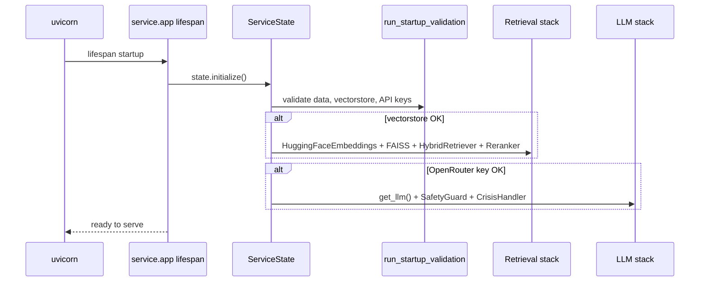

# Linux / Docker Deployment Validation — Project_12

**Date:** 2026-06-08  
**Scope:** Static audit of Dockerfile, docker-compose, startup, model/vectorstore loading  
**Live Docker run:** Not executed on validation host (Docker not installed)  
**Mind-Sanctuary:** Not modified

---

## 1. Executive Summary

| Area | Verdict |
|------|---------|
| Dockerfile structure | **PASS with gaps** |
| docker-compose.yml | **PASS with gaps** |
| Startup sequence | **PASS** (well-defined) |
| Vectorstore loading | **PASS** (pre-built index in repo; Docker path uses auto-ingest) |
| Model loading | **PASS** (lazy load in `ServiceState`) |
| Environment variables | **PASS** (documented; compose enforces API key) |
| Production readiness (Linux) | **READY after fixes below** |

---

## 2. Dockerfile Audit

**File:** `Project_12/Dockerfile`

```dockerfile
FROM python:3.10-slim
WORKDIR /app
RUN apt-get update && apt-get install -y --no-install-recommends build-essential
COPY requirements.txt .
RUN pip install --no-cache-dir -r requirements.txt
COPY config.py ingest.py llm_router.py main.py ./
COPY memory/ retrieval/ safety/ utils/ service/ data/ ./
ENV PROJECT12_AUTO_INGEST=true
CMD ["python", "-m", "uvicorn", "service.app:app", "--host", "0.0.0.0", "--port", "8100"]
```

### Findings

| # | Check | Status | Notes |
|---|-------|--------|-------|
| D1 | Base image `python:3.10-slim` | ✅ | Matches Python 3.10 requirement |
| D2 | System deps for PyTorch | ⚠️ **GAP** | `build-essential` only. PyTorch CPU on Linux typically needs **`libgomp1`** (OpenMP). Recommend adding: `libgomp1 libglib2.0-0` |
| D3 | `requirements.txt` install | ✅ | All Python deps installed at build |
| D4 | `torch` version pinning | ⚠️ **GAP** | Not pinned — may pull incompatible version at build time |
| D5 | Source code copied | ✅ | `service/`, `safety/`, `retrieval/`, etc. |
| D6 | PDF data copied | ✅ | `data/` includes 11 psychiatry PDFs |
| D7 | Pre-built vectorstore copied | ❌ **GAP** | `vectorstore/` (100 MB FAISS index in repo) **not** in `COPY` — first boot rebuilds from PDFs |
| D8 | `.dockerignore` | ✅ | Excludes `.env`, venv, `__pycache__` |
| D9 | Healthcheck | ✅ | HTTP GET `/health` on port 8100 |
| D10 | `HF_HOME` / cache dir | ✅ | `/app/.cache/huggingface` created |
| D11 | EXPOSE 8100 | ✅ | Matches `PROJECT12_PORT` |

### Recommended Dockerfile additions (Project_12 only — not applied in this pass)

```dockerfile
RUN apt-get update && apt-get install -y --no-install-recommends \
    build-essential libgomp1 \
    && rm -rf /var/lib/apt/lists/*

# Optional: skip 15–30 min first-boot ingest if index baked in
COPY vectorstore/ vectorstore/
```

---

## 3. docker-compose.yml Audit

**File:** `Project_12/docker-compose.yml`

| # | Check | Status | Notes |
|---|-------|--------|-------|
| C1 | Build context | ✅ | `.` with `Dockerfile` |
| C2 | Port mapping | ✅ | `${PROJECT12_PORT:-8100}:8100` |
| C3 | `env_file: .env` | ✅ | Loads secrets from host |
| C4 | `PROJECT12_API_KEY` required | ✅ | `${PROJECT12_API_KEY:?...}` fails fast if unset |
| C5 | `PROJECT12_AUTO_INGEST=true` | ✅ | Builds vectorstore on first start if volume empty |
| C6 | Named volumes | ✅ | `vectorstore`, `memory`, `hf_cache` persist |
| C7 | Healthcheck | ✅ | 120s `start_period` |
| C8 | Memory limit | ⚠️ **GAP** | No `deploy.resources.limits.memory` — recommend **≥4 GB** |
| C9 | Restart policy | ✅ | `unless-stopped` |
| C10 | Network for Supabase edge | ⚠️ | Compose exposes `8100` locally only; cloud needs public URL / reverse proxy |

### Volume behavior

| Volume | Mount | First boot |
|--------|-------|------------|
| `project12_vectorstore` | `/app/vectorstore` | Empty → auto-ingest from PDFs in image (~15–30 min) |
| `project12_memory` | `/app/memory_data` | Empty JSON stores created at runtime |
| `project12_hf_cache` | `/app/.cache/huggingface` | Models download on first inference (~2 GB) |

**Note:** Pre-built `vectorstore/index.faiss` (56 MB) + `index.pkl` (44 MB) exist in repo but are **not** baked into image. Baking them in would eliminate first-boot ingest.

---

## 4. Startup Sequence Validation



### Startup checks (`service/startup.py`)

| Check | Purpose |
|-------|---------|
| `data_directory` | PDFs exist in `data/` |
| `vectorstore_files` / `vectorstore_build` | FAISS index or auto-ingest |
| `openrouter_api_key` | Required for `/chat`, `/crisis-detection` LLM path |
| `api_key` | `PROJECT12_API_KEY` ≥ 16 chars when auth enabled |

### Readiness endpoints

| Endpoint | Auth | Meaning |
|----------|------|---------|
| `GET /health` | No | Process alive |
| `GET /ready` | No | Vectorstore + LLM stacks loaded |
| `GET /metrics` | Yes | Operational counters |

### Timing expectations (Linux Docker, first boot)

| Phase | Estimated duration |
|-------|-------------------|
| pip install (build) | 5–10 min |
| HuggingFace model download | 5–15 min |
| Auto-ingest (11 PDFs) | 15–45 min |
| Subsequent boots (cached volumes) | 30–120 s |

`start_period: 120s` in healthcheck may be **insufficient for first boot** — expect 2–3 healthcheck retries before `healthy`.

---

## 5. Vectorstore Loading Validation

| Item | Status | Detail |
|------|--------|--------|
| Index in repo | ✅ | `vectorstore/index.faiss` (56 MB), `index.pkl` (44 MB), 36,464 chunks |
| Loader code | ✅ | `FAISS.load_local()` in `service/loader.py` |
| Hybrid retrieval | ✅ | BM25 + dense FAISS (`retrieval/hybrid_retriever.py`) |
| Reranker | ✅ | `CrossEncoder(ms-marco-MiniLM-L-6-v2)` — requires torch |
| Docker first boot | ⚠️ | Empty volume triggers full re-ingest unless index copied into image/volume |

### Validation script (config-only, no torch)

`scripts/validate_service.py` confirms paths and startup checks without importing torch-heavy stacks if import fails.

---

## 6. Model Loading Validation

| Component | Model | Loaded when |
|-----------|-------|-------------|
| Embeddings | `sentence-transformers/all-MiniLM-L6-v2` | `_load_retrieval_stack()` |
| Reranker | `cross-encoder/ms-marco-MiniLM-L-6-v2` | `_load_retrieval_stack()` |
| LLM | `openrouter/free` (configurable) | `_load_llm_stack()` |
| Safety classifier | Same LLM via `SafetyGuard` | `_load_llm_stack()` |

All loading is **lazy, thread-safe** (`threading.RLock` in `ServiceState`).

---

## 7. Environment Variables

### Required

| Variable | Min length | Used by |
|----------|------------|---------|
| `PROJECT12_API_KEY` | 16 | All inference endpoints (auth middleware) |
| `OPENROUTER_API_KEY` | — | `/chat`, `/crisis-detection` LLM |

### Important defaults (Docker)

| Variable | Docker default | Notes |
|----------|----------------|-------|
| `PROJECT12_AUTO_INGEST` | `true` | Builds vectorstore if missing |
| `PROJECT12_AUTH_ENABLED` | `true` | Set `false` only for local debug |
| `PROJECT12_HOST` | `0.0.0.0` | Bind all interfaces |
| `PROJECT12_PORT` | `8100` | |
| `PROJECT12_LLM_TIMEOUT_SECONDS` | `30` | Crisis classify thread timeout |

Full list: `Project_12/.env.example`

---

## 8. Deployment Readiness Checklist (Linux)

| Step | Command / action |
|------|------------------|
| 1 | `cd Project_12 && cp .env.example .env` — set keys |
| 2 | Add `libgomp1` to Dockerfile (recommended) |
| 3 | `docker compose up --build -d` |
| 4 | `docker compose logs -f` — watch ingest + model download |
| 5 | `curl http://localhost:8100/ready` — wait for `"ready": true` |
| 6 | Test retrieve: `POST /retrieve` with `Authorization: Bearer $PROJECT12_API_KEY` |
| 7 | Test crisis: `POST /crisis-detection` with crisis text |
| 8 | Allocate ≥4 GB RAM to container |
| 9 | Expose service URL to Supabase edge (`PROJECT12_SERVICE_URL`) |

---

## 9. Gaps Blocking Staging Close-Out

| ID | Gap | Severity | Mitigation |
|----|-----|----------|------------|
| G1 | Docker not validated live on host | Medium | Run on Linux CI or cloud VM |
| G2 | `libgomp1` missing from Dockerfile | Medium | Add before production deploy |
| G3 | Vectorstore not baked into image | Low | COPY `vectorstore/` or seed volume |
| G4 | `torch` unpinned | Medium | Pin in `requirements.txt` |
| G5 | Healthcheck `start_period` may be short for first ingest | Low | Increase to 300s or use `/ready` probe |

---

## 10. Verdict

**Linux/Docker is the correct and supported deployment path for Project_12.** Configuration is structurally sound; minor Dockerfile hardening (OpenMP libs, optional vectorstore bake-in, torch pin) recommended before production. Windows native development remains blocked per `WINDOWS_TORCH_ROOT_CAUSE.md`.

**B.4 / B.5:** Not started.
