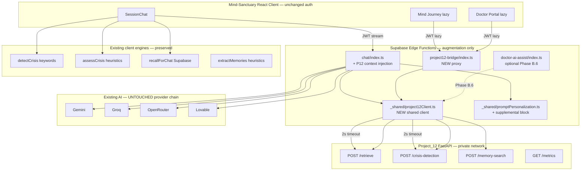
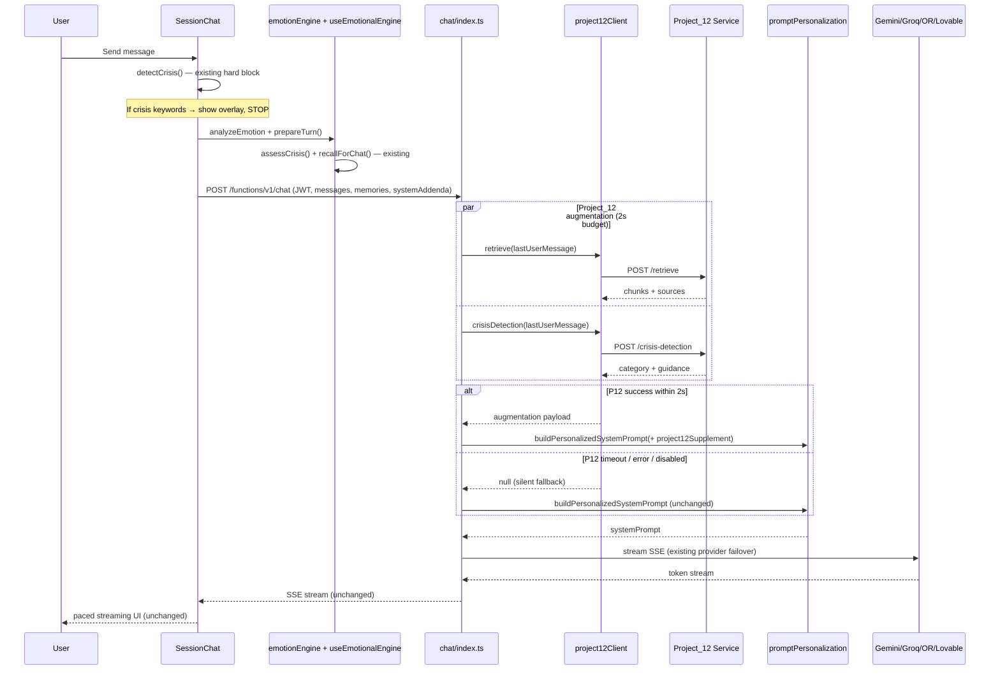
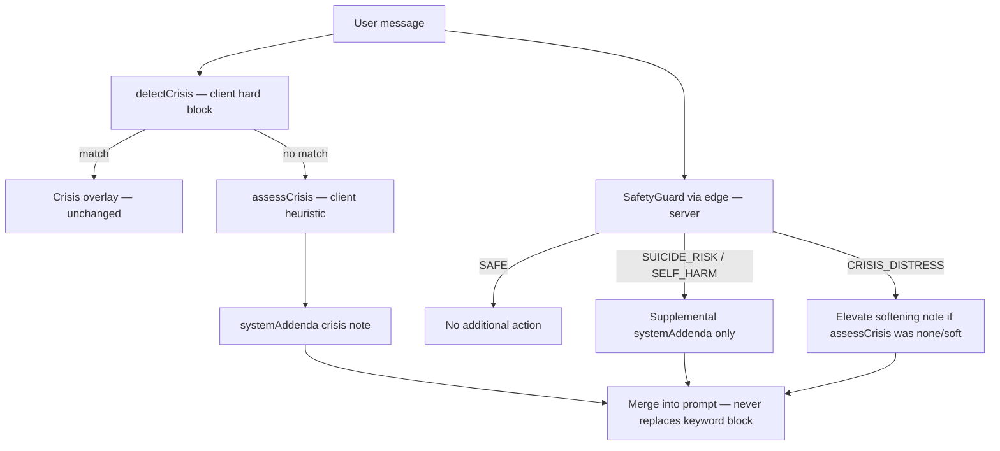
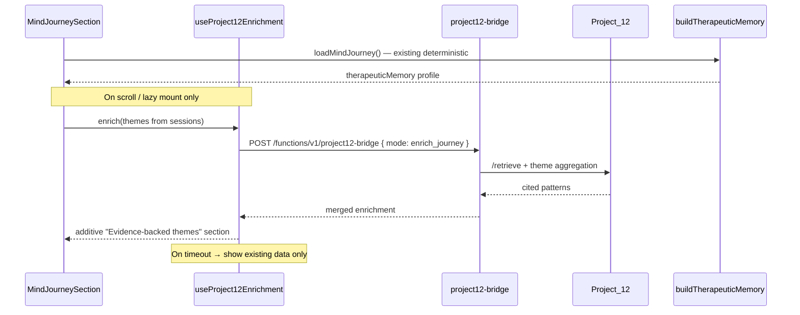
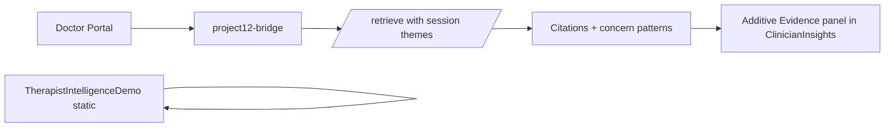
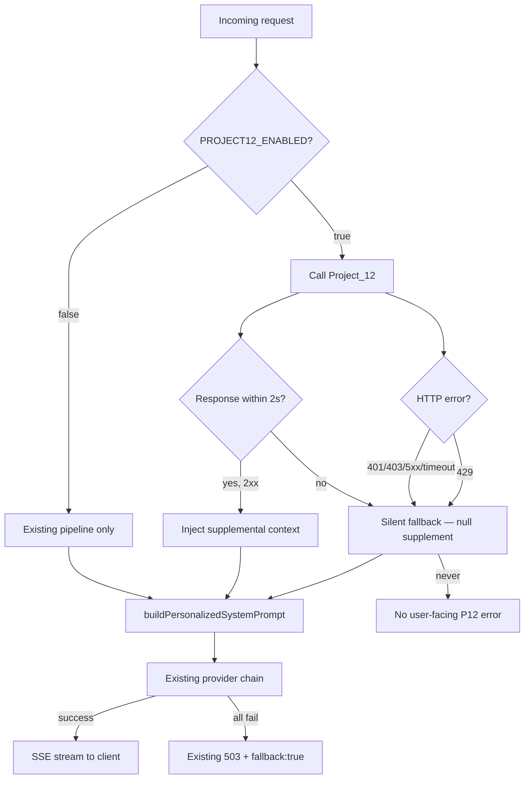

# Phase B — Safe Integration Audit

**Date:** 2026-06-08  
**Status:** B.1 complete — **awaiting approval before any code changes**  
**Scope:** Integrate Project_12 as optional enhancement layer into Mind-Sanctuary-main

---

## Executive Summary

Project_12 is a secured FastAPI microservice (RAG retrieval, SafetyGuard crisis classification, memory search). Mind-Sanctuary is a React + Supabase app with a multi-provider chat edge function and client-side heuristic engines.

**Integration principle:** Project_12 augments context — it is **not** a fifth AI provider. All existing provider routing (Gemini → Groq → OpenRouter → Lovable) remains unchanged.

**Kill switch:** `PROJECT12_ENABLED=false` disables all Project_12 calls instantly with zero user impact.

---

## 1. Complete Integration Architecture



### Layer responsibilities

| Layer | Role | Changes |
|-------|------|---------|
| **React client** | UI, streaming, existing heuristics | Minimal — lazy enrichment hooks only |
| **chat edge function** | Pre-fetch P12 context, inject into prompt, stream via existing providers | Augment `systemAddenda` block |
| **project12-bridge** | Auth-gated proxy for non-chat features | New edge function |
| **project12Client** | Timeout, retry, fallback, telemetry | New shared module |
| **Project_12 service** | RAG + SafetyGuard + memory search | No changes required |
| **Provider chain** | LLM generation | **No changes** |

---

## 2. Data Flow Diagram

### B.3 — Chat augmentation flow (critical path)



### B.4 — Crisis enhancement flow (additive)



**Rule:** `detectCrisis()` client block is **authoritative** for stopping the LLM call. SafetyGuard is **supplementary** for prompt softening and clinician signals.

### B.5 — Memory / Mind Journey flow (lazy, non-blocking)



**Note:** Project_12 JSON patient memory (`PSY-XXXX` IDs) does **not** map to Supabase user UUIDs. Enrichment uses **query-based retrieval** on session theme text, not P12 patient profiles. No database schema change required.

### B.6 — Therapist intelligence flow (additive)



Static demo cohort remains. New "Clinical Evidence" panel appears only when bridge returns data.

---

## 3. Files That WILL Be Modified

### Phase B.2 — Bridge layer

| File | Change |
|------|--------|
| `Mind-Sanctuary-main/supabase/functions/chat/index.ts` | Import `project12Client`; parallel P12 fetch before prompt build; inject supplement |
| `Mind-Sanctuary-main/supabase/functions/_shared/promptPersonalization.ts` | Add optional `project12Supplement?: Project12Supplement` parameter; append supplemental block **without replacing** existing prompt |

### Phase B.3 — Chat augmentation

| File | Change |
|------|--------|
| `Mind-Sanctuary-main/src/lib/ai/promptPersonalization.ts` | Mirror new `Project12Supplement` types (sync with edge `_shared`) |

### Phase B.4 — Crisis enhancement

| File | Change |
|------|--------|
| `Mind-Sanctuary-main/supabase/functions/chat/index.ts` | Map SafetyGuard category → supplemental `systemAddenda` with confidence metadata |
| `Mind-Sanctuary-main/src/lib/crisis/awareness.ts` | Add `mergeProject12CrisisSignal()` type helper (additive merge only) |

### Phase B.5 — Memory / Mind Journey

| File | Change |
|------|--------|
| `Mind-Sanctuary-main/src/lib/mindJourney/buildAdvancedLayers.ts` | Accept optional P12 enrichment overlay |
| `Mind-Sanctuary-main/src/lib/mindJourney/types.ts` | Add `Project12Enrichment` optional fields |
| `Mind-Sanctuary-main/src/components/mindJourney/JourneyTherapeuticMemorySection.tsx` | Render additive evidence section when present |

### Phase B.6 — Therapist intelligence

| File | Change |
|------|--------|
| `Mind-Sanctuary-main/src/components/doctor/ClinicianInsights.tsx` | Additive "Clinical Evidence" lazy panel |
| `Mind-Sanctuary-main/supabase/functions/doctor-ai-assist/index.ts` | Optional: call P12 `/retrieve` in `summarize_patient_trends` mode |

### Phase B.7 — Performance

| File | Change |
|------|--------|
| `Mind-Sanctuary-main/supabase/functions/_shared/project12Client.ts` | 2000ms timeout, 1 retry, in-memory cache (60s TTL per query hash) |

**Total modified:** ~10 files (all additive changes)

---

## 4. Files That WILL Be Created

| File | Purpose |
|------|---------|
| `supabase/functions/_shared/project12Client.ts` | Typed P12 HTTP client with timeout, retry, fallback, telemetry |
| `supabase/functions/_shared/project12Types.ts` | Shared types for augmentation payload |
| `supabase/functions/project12-bridge/index.ts` | Auth-gated proxy for Mind Journey / therapist / non-chat calls |
| `src/lib/project12/types.ts` | Client-side types (no secrets) |
| `src/lib/project12/enrichment.ts` | Pure merge helpers for Mind Journey + memory |
| `src/hooks/useProject12Enrichment.ts` | Lazy, non-blocking enrichment hook |
| `src/components/mindJourney/Project12EvidenceSection.tsx` | Optional cited evidence UI |
| `src/components/doctor/ClinicalEvidencePanel.tsx` | Optional clinician citations UI |

**Total created:** ~8 files

---

## 5. Files That Will NOT Be Modified

| Area | Files / systems | Reason |
|------|-----------------|--------|
| **Authentication** | `AuthContext`, `requireAuth.ts`, login/signup flows | Explicit constraint |
| **Onboarding** | All onboarding components | Explicit constraint |
| **Recovery system** | Recovery components | Explicit constraint |
| **Session architecture** | `sessions` flow, `SessionChat` core send/receive logic | Explicit constraint |
| **Supabase project** | Project config, RLS policies | Explicit constraint |
| **Database schema** | All migrations, table definitions | No schema change needed |
| **Provider chain** | `buildProviders()`, `tryProvider()` loop order | Explicit constraint |
| **Streaming** | `streamChat.ts`, paced stream, SSE parsing | Server-side only augmentation |
| **Crisis hard block** | `detectCrisis()` in `SessionChat.tsx` | Must remain authoritative |
| **Memory store** | `memory/store.ts`, `emotional_memories` table | Existing system preserved |
| **Memory extractor** | `memory/extractor.ts` | Not replaced |
| **Mind Journey core** | `computeMetrics`, `buildStory`, `buildFutureSelf`, etc. | Deterministic engines unchanged |
| **Therapist demo** | `buildDemoCohort.ts` static data | Preserved as-is |
| **Dashboard architecture** | `Dashboard.tsx` structure | Explicit constraint |
| **Routing** | React Router config | Explicit constraint |
| **Project_12 service** | `Project_12/service/*` | Consumed as-is via HTTP |

---

## 6. Rollback Strategy

| Step | Action | Time | User impact |
|------|--------|------|-------------|
| 1 | Set `PROJECT12_ENABLED=false` in Supabase edge function secrets | < 1 min | None — chat identical to pre-integration |
| 2 | Redeploy edge functions (if env-only insufficient) | < 5 min | None |
| 3 | Revert edge function commits (`chat/index.ts`, bridge) | < 10 min | None |
| 4 | Remove lazy enrichment UI components (optional cleanup) | Next deploy | Journey/doctor show existing data only |
| 5 | Stop Project_12 container | < 1 min | None if flag already off |

**Guarantees:**
- No database migrations to reverse
- No auth changes to reverse
- Provider chain never removed — rollback = skip P12 pre-fetch
- Client crisis block independent of P12

---

## 7. Failure Strategy



### Failure behavior matrix

| Failure | Chat behavior | Mind Journey | Doctor portal | User sees |
|---------|---------------|--------------|---------------|-----------|
| P12 down | Skip augmentation | Existing data only | Existing scaffold | Nothing |
| P12 timeout (>2s) | Skip augmentation | Skip enrichment | Skip panel | Nothing |
| P12 401 (key mismatch) | Skip + server log | Skip | Skip | Nothing |
| P12 429 rate limit | Skip + server log | Skip | Skip | Nothing |
| All providers fail | Existing 503 fallback | N/A | N/A | Existing error toast |
| `PROJECT12_ENABLED=false` | Existing pipeline | No P12 calls | No P12 calls | Nothing |

**Rules:**
- Never return HTTP 500 to client due to P12 failure
- Never block streaming waiting for P12
- Never expose P12 URL or API key to frontend
- Log P12 failures server-side only (no user message content in logs)

---

## 8. Phase-by-Phase Implementation Plan

### B.2 — Bridge layer

**`project12Client.ts` interface:**

```typescript
interface Project12ClientConfig {
  baseUrl: string;       // PROJECT12_SERVICE_URL (server only)
  apiKey: string;        // PROJECT12_API_KEY (server only)
  timeoutMs: number;     // default 2000
  enabled: boolean;        // PROJECT12_ENABLED
}

interface Project12Augmentation {
  retrieval: { context: string; sources: SourceDoc[] } | null;
  crisis: { category: string; confidence: string; guidance: string | null } | null;
  latencyMs: number;
  fallback: boolean;
}
```

- 1 retry on network error (not on 4xx)
- Structured logging: `{ event, endpoint, status, latencyMs, fallback }` — no message body
- Returns `null` on any failure

**`project12-bridge/index.ts` modes:**

| Mode | P12 endpoint | Auth |
|------|-------------|------|
| `retrieve` | POST /retrieve | User JWT + doctor role check where applicable |
| `crisis_detection` | POST /crisis-detection | User JWT |
| `enrich_journey` | POST /retrieve | User JWT |
| `clinical_evidence` | POST /retrieve | Doctor JWT + has_role |

### B.3 — Chat augmentation

Inject into prompt as **supplemental block** (appended after existing content):

```
[PROJECT12-SUPPLEMENT — evidence context only; do not override Dr. Sentinel persona]
Retrieved clinical reference (educational, not diagnostic):
{context}

Sources: {source list}

[Crisis signal supplement if non-SAFE]
SafetyGuard classification: {category} (confidence: supplementary)
{guidance if present}
```

Existing `buildPersonalizedSystemPrompt` output is **never replaced** — only appended.

### B.4 — Crisis enhancement

| Existing signal | P12 signal | Merge behavior |
|----------------|------------|----------------|
| `detectCrisis()` = true | any | Client block wins — LLM never called |
| `assessCrisis()` = acute | SUICIDE_RISK | Keep acute note; add P12 guidance as supplement |
| `assessCrisis()` = none | CRISIS_DISTRESS | Elevate to soft crisis note |
| `assessCrisis()` = soft | SELF_HARM | Elevate to elevated note |

Emergency flag: if P12 returns `SUICIDE_RISK` or `SELF_HARM`, set `X-Crisis-Signal: elevated` response header for optional client telemetry (does not change crisis UI flow).

### B.5 — Therapeutic memory enhancement

Merge strategy:

```typescript
{
  ...existingTherapeuticMemory,  // from buildTherapeuticMemory()
  project12Overlay?: {
    evidenceThemes: string[];      // from retrieval context headings
    citedSources: SourceDoc[];     // PDF page references
    concernPatterns: string[];     // keyword overlap with session themes
  }
}
```

### B.6 — Therapist intelligence

Additive panel in `ClinicianInsights.tsx`:
- "Clinical Evidence References" — cited PDF sources
- "Recurring Concern Patterns" — theme frequency from session text + retrieval
- Loads lazily via `project12-bridge` — does not block portal render

### B.7 — Performance requirements

| Requirement | Implementation |
|-------------|----------------|
| P12 timeout ≤ 2s | `AbortController` in project12Client |
| No dashboard blocking | Lazy hooks with `enabled: isVisible` |
| No extra blocking queries in chat | P12 fetch parallel with prompt build, not sequential with client |
| Caching | 60s in-memory cache keyed by `hash(query)` in edge function |
| Background retrieval | Mind Journey / doctor panels fetch after initial render |

**Latency budget:**

| Path | P12 budget | Total chat TTFB impact |
|------|-----------|--------------------------|
| Chat (server) | ≤ 2000ms parallel | 0ms if P12 slow (fallback skips wait at timeout) |
| Mind Journey | background | 0ms blocking |
| Doctor portal | background | 0ms blocking |

### B.8 — Security requirements

| Requirement | Implementation |
|-------------|----------------|
| Preserve auth | `requireAuth()` on bridge; chat already requires JWT |
| Preserve RLS | No direct DB access from P12; bridge uses authenticated user context |
| Never expose P12 API key | Server env only (`PROJECT12_API_KEY`) |
| Never expose P12 URL | Server env only (`PROJECT12_SERVICE_URL`) |
| Never expose internal prompts | P12 supplement constructed server-side only |
| Request validation | Bridge validates body size ≤ 8KB, text length ≤ 4000 |
| Payload limits | Reject oversized bridge requests with 422 |
| Telemetry | `trackProductEvent('project12.augmentation', { fallback, latencyMs })` server-side |
| Audit logs | Edge function logs: userId, endpoint, fallback, latency — no message content |

### B.9 — Testing checklist

| # | Test | Pass criteria |
|---|------|---------------|
| 1 | Chat with P12 online | Responses include evidence; stream works |
| 2 | Chat with P12 offline | Identical to pre-integration; no error toast |
| 3 | Crisis detection | `detectCrisis()` still blocks; assessCrisis still works |
| 4 | Mind Journey | Loads without P12; enrichment appears when available |
| 5 | Therapist dashboard | Renders without P12; evidence panel optional |
| 6 | Memory | `recallForChat` + `extractMemories` unchanged |
| 7 | Streaming | SSE pacing unchanged; no stall |
| 8 | Arabic | Language personalization unchanged; P12 context is English PDF (supplement only) |
| 9 | English | Same |
| 10 | Mobile | No new blocking requests on mount |

---

## 9. Environment Variables (new — edge function secrets only)

| Variable | Required | Default | Description |
|----------|----------|---------|-------------|
| `PROJECT12_ENABLED` | No | `false` | Master kill switch |
| `PROJECT12_SERVICE_URL` | When enabled | — | e.g. `http://project12:8100` |
| `PROJECT12_API_KEY` | When enabled | — | Same key as P12 service |
| `PROJECT12_TIMEOUT_MS` | No | `2000` | Max wait per P12 call |
| `PROJECT12_CACHE_TTL_MS` | No | `60000` | Retrieval cache TTL |

**Not added to frontend `.env`** — ever.

---

## 10. Known Constraints

| Constraint | Impact | Workaround |
|------------|--------|------------|
| P12 patient memory uses `PSY-XXXX` IDs | Cannot map to Supabase UUIDs without schema change | Use query-based retrieval on session themes instead |
| P12 knowledge base is English psychiatry PDF | Arabic chat replies unaffected; supplement is reference-only | Prompt instructs model to reply in user language |
| P12 `/chat` endpoint not used | Mind-Sanctuary providers generate responses | Use `/retrieve` + `/crisis-detection` only |
| Single P12 instance | Rate limits apply at service level | 2s timeout + cache reduces call volume |

---

## 11. Production Readiness (projected post-implementation)

| Criterion | Pre-B | Post-B (projected) |
|-----------|-------|-------------------|
| Chat without P12 | PASS | PASS |
| Chat with P12 | N/A | PASS (with flag on) |
| Instant rollback | N/A | PASS (feature flag) |
| No auth changes | PASS | PASS |
| No schema changes | PASS | PASS |
| Provider chain preserved | PASS | PASS |
| Security (key not exposed) | N/A | PASS |
| Arabic/English | PASS | PASS |
| Mobile | PASS | PASS |

---

## 12. Approval Gate

**No code will be implemented until you confirm:**

1. Architecture approach (server-side augmentation in `chat/index.ts` + separate `project12-bridge`)
2. 2-second timeout budget
3. Feature flag default (`PROJECT12_ENABLED=false` on first deploy)
4. Phase order: B.2 → B.3 → B.4 first (chat + crisis); B.5 → B.6 second (lazy enrichment)
5. Accept that P12 JSON patient memory will not be wired to Supabase users (no schema change)

**Reply to proceed with implementation.**
