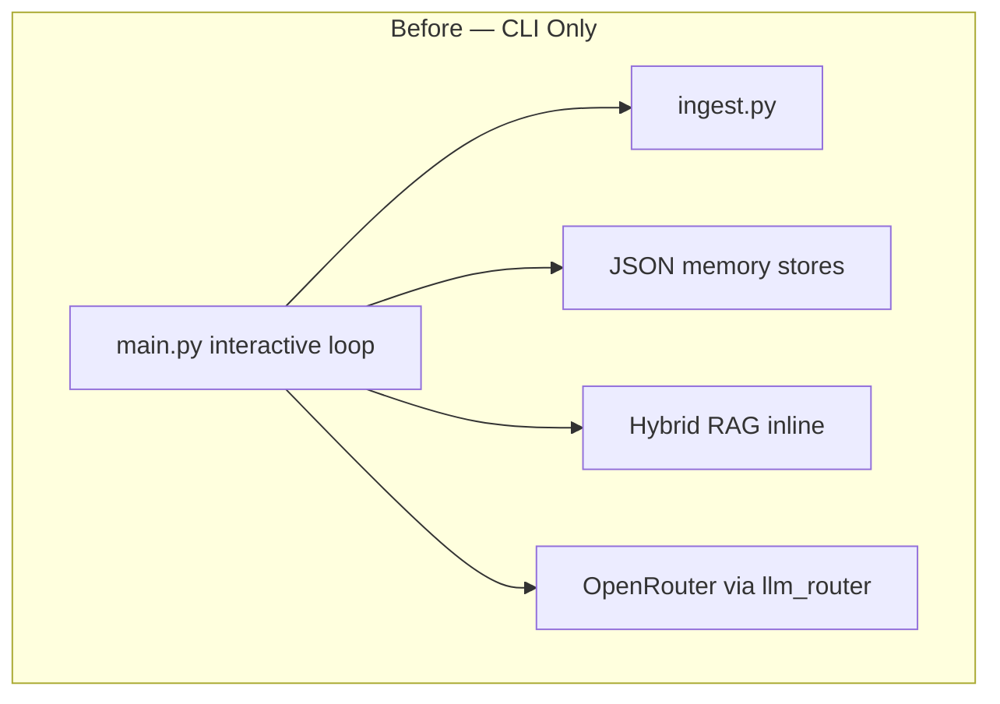
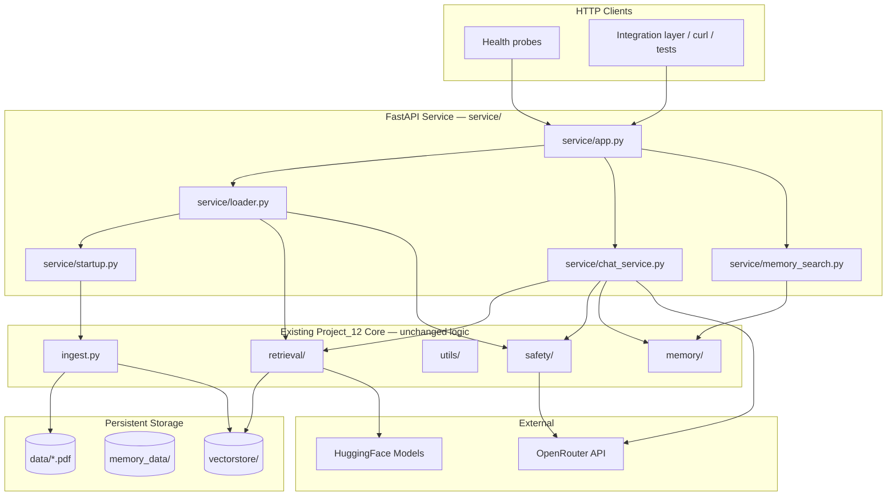
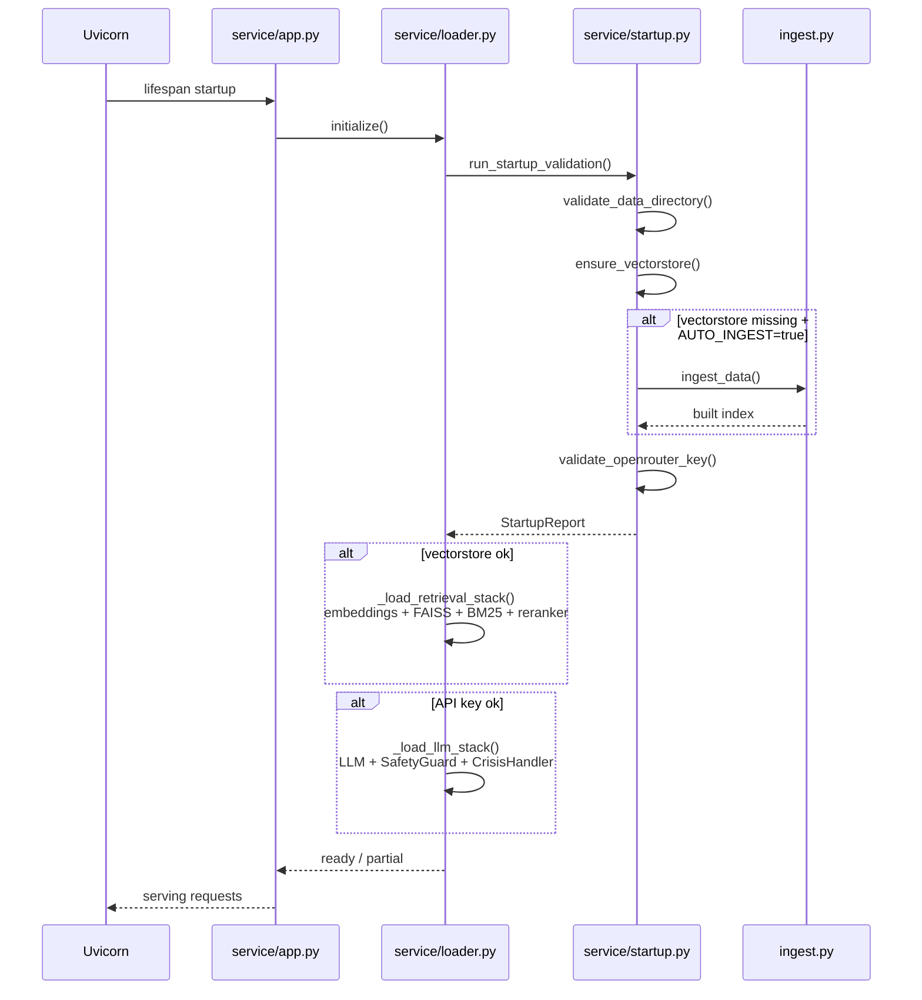

# Project_12 Production Audit

**Date:** 2026-06-08  
**Scope:** Project_12 only — Mind-Sanctuary-main untouched  
**Status:** Phase A complete

---

## Pre-Implementation Architecture

### Issues identified before productionization

| # | Issue | Severity |
|---|-------|----------|
| 1 | Hardcoded `F:\Education\...` paths in `profile_store.py`, `chat_store.py` | Critical |
| 2 | Relative `memory_data/` paths break when CWD differs | High |
| 3 | No HTTP API — CLI only | High |
| 4 | No health/readiness probes | High |
| 5 | No structured logging | Medium |
| 6 | No timeout protection on LLM calls | Medium |
| 7 | No Docker deployment | Medium |
| 8 | `pandas` missing from requirements.txt | Low |
| 9 | `venv310` references foreign Python path (`C:\Users\OO7\...`) | Environment |

---

## Post-Implementation Architecture

---

## Startup Flow

### Endpoint readiness matrix

| Endpoint | Requires retrieval | Requires LLM |
|----------|-------------------|--------------|
| `GET /health` | No | No |
| `GET /ready` | Checks both | Checks both |
| `POST /retrieve` | Yes | No |
| `POST /memory-search` | No | No |
| `POST /crisis-detection` | No | Yes |
| `POST /chat` | Yes | Yes |

---

## Files Modified

| File | Change |
|------|--------|
| `config.py` | Centralized env-based paths, service config, operational flags |
| `memory/profile_store.py` | Removed hardcoded `F:\Education\...` path; uses `config.PROFILE_FILE` |
| `memory/chat_store.py` | Removed hardcoded path; uses `config.CHAT_FILE` |
| `memory/session_store.py` | Uses `config.SESSION_FILE` with dir creation |
| `memory/qa_store.py` | Uses `config.QA_FILE` with dir creation |
| `llm_router.py` | Reads API key from `config` |
| `retrieval/reranker.py` | Model name from `config.RERANKER_MODEL` |
| `ingest.py` | Path objects, returns `bool`, portable paths |
| `main.py` | `VECTORSTORE_DIR` Path compatibility |
| `requirements.txt` | Added fastapi, uvicorn, pydantic, pandas |

## Files Created

| File | Purpose |
|------|---------|
| `service/__init__.py` | Package marker |
| `service/app.py` | FastAPI app, routes, exception handlers |
| `service/models.py` | Pydantic request/response schemas |
| `service/loader.py` | Thread-safe singleton model loader |
| `service/startup.py` | Startup validation, auto-ingest |
| `service/logging_config.py` | Structured JSON logging |
| `service/chat_service.py` | RAG chat orchestration with timeouts |
| `service/memory_search.py` | Patient memory search |
| `Dockerfile` | Production container image |
| `docker-compose.yml` | Local deployment with volumes |
| `.env.example` | Environment variable reference |
| `.dockerignore` | Build context exclusions |
| `scripts/validate_service.py` | Pre-deploy validation script |
| `PROJECT12_PRODUCTION_AUDIT.md` | This document |
| `PROJECT12_API_DOCUMENTATION.md` | API reference |
| `PROJECT12_DEPLOYMENT_GUIDE.md` | Deployment instructions |

## Files NOT Modified

- `Mind-Sanctuary-main/` — **untouched**
- Supabase edge functions — **untouched**
- Frontend — **untouched**
- `safety/safety_guard.py`, `safety/crisis_handler.py` — logic unchanged
- `retrieval/hybrid_retriever.py` — logic unchanged
- `utils/explainability.py` — logic unchanged
- `evaluation/` — evaluation scripts unchanged

---

## Rollback Strategy

| Scenario | Action | Impact |
|----------|--------|--------|
| Service misbehaves | Stop container / kill uvicorn process | CLI `main.py` still works independently |
| Bad deployment | `docker compose down` + revert Project_12 commits | No Mind-Sanctuary impact |
| Vectorstore corruption | Delete `vectorstore/`, set `PROJECT12_AUTO_INGEST=true`, restart | Rebuilds from PDFs |
| Config regression | Restore `config.py` from git | Paths revert to env-based defaults |
| API breaking change | Old CLI (`main.py`) unaffected — parallel code paths | Zero production impact on Mind-Sanctuary |

**Key guarantee:** Mind-Sanctuary-main was not modified. Rollback is isolated to Project_12.

---

## Remaining Risks

| # | Risk | Severity | Mitigation |
|---|------|----------|------------|
| R1 | `venv310` broken on this machine (foreign Python path) | High | Use Docker or create fresh venv |
| R2 | Cold start downloads ~400MB HuggingFace models | High | Pre-cache in Docker image; use volume for HF cache |
| R3 | First ingest takes several minutes on CPU | Medium | Pre-build vectorstore; mount as volume |
| R4 | OpenRouter dependency for `/chat` and `/crisis-detection` | Medium | `/retrieve` and `/memory-search` work without LLM |
| R5 | `allow_dangerous_deserialization=True` on FAISS load | Medium | Acceptable for self-built index; do not load untrusted indexes |
| R6 | No API authentication on service | High | Deploy behind reverse proxy / internal network only until Phase B |
| R7 | LLM timeout may truncate long responses | Low | Configurable via `PROJECT12_LLM_TIMEOUT_SECONDS` |
| R8 | Memory search is substring-based, not semantic | Low | Sufficient for Phase A; semantic search in future phase |

---

## Production Readiness Verdict

| Criterion | Status |
|-----------|--------|
| Hardcoded paths removed | **PASS** |
| Environment variable configuration | **PASS** |
| FAISS vectorstore validation | **PASS** (index exists at `vectorstore/`) |
| Auto-ingest on missing vectorstore | **PASS** |
| FastAPI production API | **PASS** |
| All 6 endpoints implemented | **PASS** |
| Error handling (no crashes) | **PASS** |
| Timeout protection | **PASS** |
| Structured logging | **PASS** |
| Docker + docker-compose | **PASS** |
| Health + readiness probes | **PASS** |
| Documentation | **PASS** |
| Live runtime validation | **BLOCKED** — no working Python on host; use Docker |
| API authentication | **NOT READY** — required before public exposure |
| HTTPS / TLS termination | **NOT READY** — deploy behind reverse proxy |

### Overall: **READY for internal/staging deployment via Docker**

Project_12 is production-ready as a **standalone AI microservice** for integration testing. It should not be exposed publicly without authentication and TLS. Mind-Sanctuary integration (Phase B) remains a separate step.
