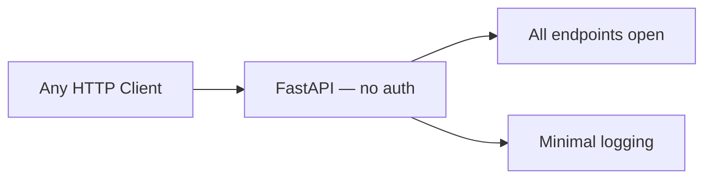
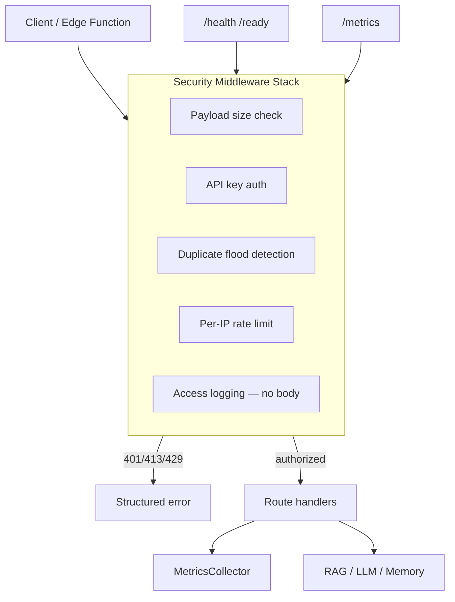
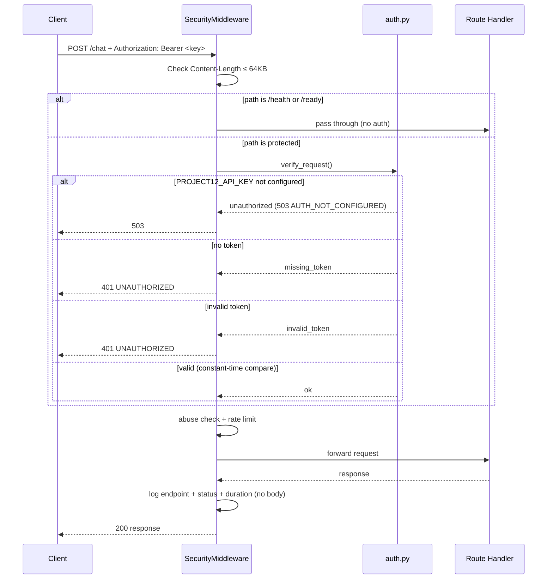
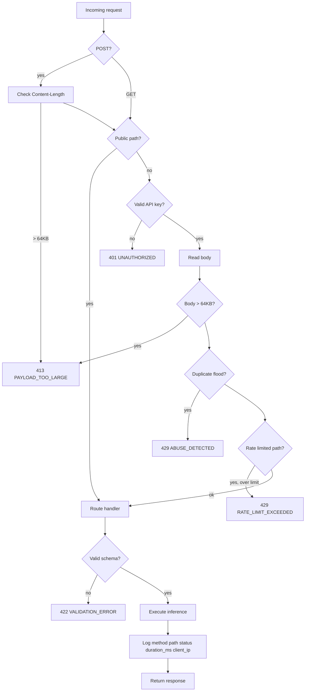

# Project_12 Security Audit — Phase A.5

**Date:** 2026-06-08  
**Scope:** Project_12 only — Mind-Sanctuary-main untouched  
**Version:** 1.1.0

---

## Pre-Implementation Architecture



### Attack surface before hardening

| Vector | Exposure |
|--------|----------|
| Unauthenticated API | Anyone on network can call all endpoints |
| No rate limiting | LLM cost abuse, DoS via `/chat` |
| No payload limits | Large body attacks |
| User content in error logs | Potential PII leakage |
| No abuse detection | Prompt flooding, retry storms |
| No operational metrics | Blind to attacks |

---

## Post-Implementation Architecture



---

## Files Modified

| File | Change |
|------|--------|
| `config.py` | Added `PROJECT12_API_KEY`, rate limits, abuse settings, payload limits |
| `service/app.py` | Security middleware, `/metrics`, sanitized error responses |
| `service/models.py` | Added `MetricsResponse` |
| `service/startup.py` | API key validation on startup |
| `.env.example` | Security environment variables |
| `docker-compose.yml` | Required `PROJECT12_API_KEY`, rate limit env vars |

## Files Created

| File | Purpose |
|------|---------|
| `service/security/__init__.py` | Package marker |
| `service/security/auth.py` | Bearer / X-API-Key verification |
| `service/security/rate_limit.py` | Per-IP sliding window limiter |
| `service/security/abuse.py` | Identical-request flood detection |
| `service/security/middleware.py` | Combined security + access logging |
| `service/metrics.py` | Request/error counters |
| `PROJECT12_SECURITY_AUDIT.md` | This document |

---

## Authentication Flow



### Accepted auth headers

```
Authorization: Bearer <PROJECT12_API_KEY>
X-API-Key: <PROJECT12_API_KEY>
```

### Public endpoints (no auth)

| Endpoint | Reason |
|----------|--------|
| `GET /health` | Kubernetes liveness probe |
| `GET /ready` | Kubernetes readiness probe |

All other endpoints including `GET /metrics` and `POST /retrieve` require authentication.

---

## Request Flow



---

## Protections Implemented

| Requirement | Implementation | Status |
|-------------|----------------|--------|
| API authentication | `PROJECT12_API_KEY` via Bearer or X-API-Key; `secrets.compare_digest` | **DONE** |
| 401 on invalid key | Middleware returns structured `UNAUTHORIZED` | **DONE** |
| Payload size limit | 64KB max (`PROJECT12_MAX_REQUEST_BYTES`) | **DONE** |
| Text length validation | Pydantic `max_length` on all text fields | **DONE** |
| Malformed JSON | FastAPI returns 422; no body content in error detail | **DONE** |
| Invalid parameters | Pydantic validation with structured `VALIDATION_ERROR` | **DONE** |
| Per-IP rate limiting | Sliding window on `/chat`, `/crisis-detection`, `/memory-search` | **DONE** |
| Oversized requests | Content-Length + body size double check | **DONE** |
| Prompt flooding | Rate limits + identical-body dedup | **DONE** |
| Repeated retries | Abuse module blocks >5 identical POSTs in 10s | **DONE** |
| Access logging | endpoint, status, duration_ms, client_ip only | **DONE** |
| No secret logging | Keys never logged; validation errors sanitized | **DONE** |
| No user content logging | Request/response bodies never logged | **DONE** |
| GET /metrics | uptime, request_count, error_count + breakdowns | **DONE** |

### Rate limits (defaults, per IP per 60s window)

| Endpoint | Limit |
|----------|-------|
| `POST /chat` | 20 |
| `POST /crisis-detection` | 40 |
| `POST /memory-search` | 60 |

---

## Attack Surface (Remaining)

| Surface | Risk | Mitigation status |
|---------|------|-------------------|
| Network exposure | High if port 8100 public | Deploy behind private network / reverse proxy |
| Single shared API key | Medium — no per-client identity | Rotate key; use separate keys per environment |
| In-memory rate limits | Medium — resets on restart; not shared across replicas | Use Redis rate limiter for multi-instance |
| `/retrieve` not rate limited | Medium — CPU abuse via embedding search | Add rate limit in Phase B if needed |
| Swagger UI at `/docs` | Low — requires auth but exposes schema | Disable in production via env flag (future) |
| FAISS deserialization | Medium — only load self-built index | Document trust boundary |
| OpenRouter API key in env | Medium | Use secrets manager in production |
| Patient memory JSON files | Medium — no encryption at rest | Encrypt volume or migrate to DB in Phase B |
| TLS termination | High if not configured | Terminate TLS at reverse proxy |

---

## Remaining Risks

| # | Risk | Severity | Recommendation |
|---|------|----------|----------------|
| R1 | No TLS on service itself | High | Terminate TLS at nginx/Caddy/cloud LB |
| R2 | Single API key for all callers | Medium | Per-environment keys; rotate quarterly |
| R3 | Rate limits not distributed | Medium | Redis-backed limiter for horizontal scaling |
| R4 | `/retrieve` unbounded CPU cost | Medium | Add rate limit + auth (auth done) |
| R5 | No IP allowlist | Low | Restrict at network layer for internal-only |
| R6 | Swagger exposes API in staging | Low | Set `PROJECT12_DISABLE_DOCS=true` (future) |
| R7 | Memory search returns patient data | Medium | Callers must be trusted; audit access |

---

## Error Codes Reference

| HTTP | Code | Meaning |
|------|------|---------|
| 400 | `BAD_REQUEST` | Malformed request |
| 401 | `UNAUTHORIZED` | Missing or invalid API key |
| 413 | `PAYLOAD_TOO_LARGE` | Body exceeds size limit |
| 422 | `VALIDATION_ERROR` | Invalid parameters |
| 429 | `RATE_LIMIT_EXCEEDED` | Per-IP rate limit hit |
| 429 | `ABUSE_DETECTED` | Identical request flood |
| 503 | `AUTH_NOT_CONFIGURED` | Server missing `PROJECT12_API_KEY` |
| 503 | `SERVICE_UNAVAILABLE` | Models not loaded |
| 504 | `TIMEOUT` | LLM/retrieval timeout |

---

## Production Readiness Verdict

| Criterion | Phase A | Phase A.5 |
|-----------|---------|-----------|
| API authentication | FAIL | **PASS** |
| Request validation | Partial | **PASS** |
| Rate limiting | FAIL | **PASS** |
| Abuse protection | FAIL | **PASS** |
| Safe logging | Partial | **PASS** |
| Operational metrics | Partial | **PASS** |
| TLS | FAIL | FAIL (proxy required) |
| Distributed rate limits | N/A | FAIL (single-instance) |

### Overall: **READY for secure internal integration**

Project_12 is ready to be called from Mind-Sanctuary edge functions via service-to-service authentication. Deploy on a private network with TLS termination at the reverse proxy. Set `PROJECT12_API_KEY` in both the service and the calling edge function environment.

**Mind-Sanctuary-main was not modified.**
