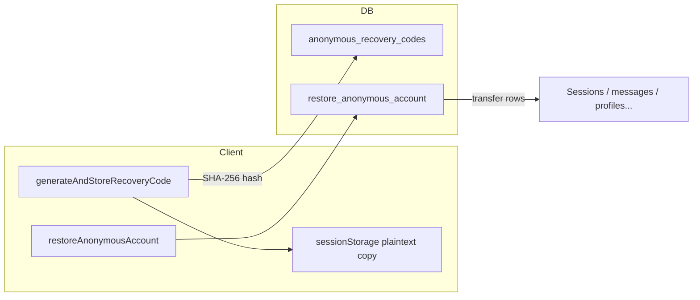

# Recovery Security Review — Anonymous Recovery Code System

**Date:** 2026-06-08  
**Phase:** D (review only — **no code changes implemented**)  
**Scope:** `anonymous_recovery_codes`, client `src/lib/recovery.ts`, SQL migrations

---

## Executive summary

The anonymous recovery system allows cross-device restoration of anonymous accounts using a one-time recovery code. The design is **sound at a high level** (hashed storage, single-use semantics, SECURITY DEFINER RPCs), but several **medium-risk gaps** should be addressed before treating recovery as production-grade for sensitive mental-health data.

**Recommendation:** Do not change behavior in this pass; schedule hardening in a dedicated security sprint.

---

## Architecture

| Component | Location |
|-----------|----------|
| Code generation | `src/lib/recovery.ts` — 16-char Crockford-like alphabet |
| Normalization | `src/lib/recovery/normalizeCode.ts` |
| DB table | `anonymous_recovery_codes` (migration `20260603135000` + `20260603170000`) |
| Restore RPC | `restore_anonymous_account` — transfers user-owned rows to new `auth.uid()` |
| Canonical hash migration | `20260603160000_recovery_code_canonical_hash.sql` |

---

## Strengths

| Control | Detail |
|---------|--------|
| **Hashed at rest** | Only `code_hash` (SHA-256) stored server-side; plaintext shown once to user |
| **Single-use intent** | `used_at` column; RPC marks used after successful transfer |
| **RLS** | Users can read/insert/update own row only (`user_id = auth.uid()`) |
| **Format validation** | 16+ normalized chars; dashed display format |
| **Legacy compat** | Canonical + dashed hash fallback in SQL (`recovery_code_canonical_hash`) |
| **No email required** | Supports truly anonymous onboarding |

---

## Risks & gaps

### High / medium

| ID | Risk | Impact | Notes |
|----|------|--------|-------|
| R1 | **Plaintext code in `sessionStorage`** | XSS or local device compromise exposes code | `RECOVERY_LOCAL_KEY` stores full code until cleared |
| R2 | **Entropy ~16 chars from 32-char alphabet** | ~80 bits — brute-force online if rate limits weak | ~32^16 combinations; mitigated by hash lookup + auth required for insert |
| R3 | **Online guessing** | Attacker with anon session could probe `restore_anonymous_account` | Needs rate limiting / lockout at RPC or edge layer (not visible in client) |
| R4 | **Account takeover via stolen code** | Full data transfer to redeemer's session | By design — code **is** the secret; users must treat like a password |
| R5 | **RPC `SECURITY DEFINER`** | Bug in transfer logic could cross users | Review `restore_anonymous_account` / `restore_schema_safe` for table list completeness |

### Low

| ID | Risk | Notes |
|----|------|-------|
| R6 | Logging | `generate` logs `displayCode` in dev console — remove/redact in production builds |
| R7 | Recovery pending UX | `sessionStorage` flags may confuse multi-tab flows |
| R8 | Email account collision | Redeem flow creates new anon session — user must sign out of real account first (guarded in `LoginPage`) |

---

## Threat model (abbreviated)

| Threat | Mitigation today | Gap |
|--------|------------------|-----|
| DB leak | Hashes only | Hint (`code_hint`) leaks 4 chars — minor |
| Shoulder surfing | User responsibility | No post-display re-auth |
| Phishing | None specific | Educate user to store code offline |
| Brute force RPC | Unknown server limits | **Verify** Supabase / custom throttling |
| XSS | Standard CSP | sessionStorage plaintext |

---

## Compliance considerations (mental health)

- Recovery code grants **full account migration** — equivalent to password for anonymous users.
- Clinician data linked via `user_id` moves with restore — appropriate if user owns code.
- **No audit log** of recovery events visible in client — recommend `auth_events` or `recovery_audit` table for clinical environments.

---

## Recommended hardening (future — not implemented)

1. **Rate-limit** `restore_anonymous_account` per IP / per session (e.g. 5 attempts / hour).
2. **Remove plaintext** from `sessionStorage` after user confirms saved (or use WebCrypto wrap with user PIN).
3. **Redact** `displayCode` from production logs.
4. **Add audit table** `recovery_events(user_id, event, created_at)`.
5. **Optional:** Argon2id instead of SHA-256 for code hashing (codes are high-entropy — SHA-256 acceptable if rate-limited).
6. **Expire unused codes** after N days with user warning.

---

## Test coverage

| Area | Tests |
|------|-------|
| Normalize / format | `src/test/recovery-normalize.test.ts` |
| Pending flags | `src/test/recovery-pending.test.ts` |
| E2E restore RPC | Manual / staging only |

---

## Verdict

| Aspect | Rating |
|--------|--------|
| Design fit for anonymous mental-health app | **Acceptable** with user education |
| Production hardening | **Incomplete** — rate limits + audit recommended |
| Blocker for local dev | **No** |
| Changes made in Phase D | **None** (review only) |

---

*End of recovery security review.*
