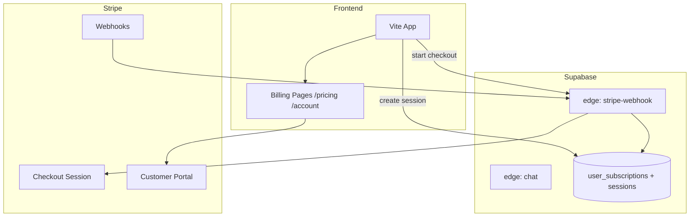

# Subscription Architecture — Design Document

**Date:** 2026-06-08  
**Phase:** E (design only — **no payments implemented**)  
**Tiers:** Free (2 sessions) · Premium (unlimited)

---

## Goals

- Gate **therapy session creation** (not login, not crisis resources).
- Integrate **Stripe** for billing without coupling to Project_12 or chat provider chain.
- Preserve anonymous + email auth paths.
- Local/dev: subscription checks disabled via env flag.

---

## Tier model

| Feature | Free | Premium |
|---------|------|---------|
| Sessions per rolling period | **2** (lifetime or monthly — recommend **lifetime** for MVP) | Unlimited |
| Chat messages within session | Unlimited | Unlimited |
| Voice | Yes | Yes |
| Mind Journey / activities | Yes (optional soft gate later) | Yes |
| Crisis resources | Always free | Always free |
| Doctor portal | N/A (role-based) | N/A |

**Session definition:** A row in `public.sessions` with `started_at` set when user enters `SessionChat` / creates new session.

---

## Data model (proposed)

```sql
-- New table (future migration)
CREATE TABLE public.user_subscriptions (
  user_id          uuid PRIMARY KEY REFERENCES auth.users(id) ON DELETE CASCADE,
  tier             text NOT NULL DEFAULT 'free' CHECK (tier IN ('free', 'premium')),
  stripe_customer_id text,
  stripe_subscription_id text,
  status           text NOT NULL DEFAULT 'active' CHECK (status IN ('active', 'past_due', 'canceled', 'trialing')),
  current_period_end timestamptz,
  updated_at       timestamptz NOT NULL DEFAULT now()
);

-- Optional usage counter (if not counting sessions table directly)
CREATE TABLE public.session_usage (
  user_id    uuid REFERENCES auth.users(id) ON DELETE CASCADE,
  period_key text NOT NULL,  -- e.g. 'lifetime' or '2026-06'
  count      int NOT NULL DEFAULT 0,
  PRIMARY KEY (user_id, period_key)
);
```

**Free tier enforcement query:**
```sql
SELECT count(*) FROM sessions WHERE user_id = $1;
-- block if count >= 2 AND tier = 'free'
```

---

## Architecture diagram



---

## Stripe integration plan

### 1. Stripe objects

| Object | Purpose |
|--------|---------|
| **Product** | `Mind Sanctuary Premium` |
| **Price** | Monthly + annual (e.g. `$9.99/mo`, `$79/yr`) |
| **Customer** | Created on first checkout; stored in `user_subscriptions.stripe_customer_id` |
| **Subscription** | Recurring billing |
| **Checkout Session** | Hosted payment page (PCI scope minimized) |
| **Customer Portal** | Manage/cancel subscription |

### 2. New edge functions (future)

| Function | Responsibility |
|----------|----------------|
| `stripe-create-checkout` | Auth JWT → create Checkout Session → return URL |
| `stripe-create-portal` | Auth JWT → Billing Portal URL |
| `stripe-webhook` | Verify signature → upsert `user_subscriptions` on `checkout.session.completed`, `customer.subscription.updated`, `deleted` |

**Secrets (server only — never in Vite):**
- `STRIPE_SECRET_KEY`
- `STRIPE_WEBHOOK_SECRET`
- `STRIPE_PRICE_ID_PREMIUM_MONTHLY` (etc.)

### 3. Webhook events

| Event | Action |
|-------|--------|
| `checkout.session.completed` | Set `tier=premium`, store customer/subscription IDs |
| `customer.subscription.updated` | Sync `status`, `current_period_end` |
| `customer.subscription.deleted` | Set `tier=free`, `status=canceled` |
| `invoice.payment_failed` | Set `status=past_due`; grace period optional |

---

## Frontend billing pages (proposed routes)

| Route | Purpose |
|-------|---------|
| `/pricing` | Compare Free vs Premium; CTA → Checkout |
| `/account/billing` | Current tier, renewal date, link to Portal |
| `/account/billing/success` | Post-checkout confirmation |
| `/account/billing/cancel` | Checkout abandoned |

**Components:**
- `PricingTable.tsx`
- `SubscriptionBadge.tsx` (dashboard)
- `SessionLimitModal.tsx` — shown when free user hits 2 sessions

**i18n:** `subscription.*` keys in `en.json` / `ar.json`

---

## Session gate (client + server)

### Client (UX)
```typescript
// Before createSession()
const { tier, sessionCount } = await fetchSubscriptionStatus();
if (tier === 'free' && sessionCount >= 2) {
  showSessionLimitModal(); // upgrade CTA
  return;
}
```

### Server (authoritative)
```typescript
// In session-create RPC or edge wrapper
if (!canCreateSession(userId)) return 402 { error: 'session_limit' };
```

**Never rely on client-only checks.**

---

## Environment flags

| Env | Purpose |
|-----|---------|
| `SUBSCRIPTION_ENFORCEMENT=false` | Local dev — unlimited sessions |
| `STRIPE_SECRET_KEY` | Edge only |
| `VITE_STRIPE_PUBLISHABLE_KEY` | Checkout redirect (publishable only) |

---

## Rollout phases (future)

| Phase | Work |
|-------|------|
| E.1 | DB migration + `user_subscriptions` |
| E.2 | Session count gate (free=2) |
| E.3 | Stripe Checkout + webhook edge |
| E.4 | Billing UI pages |
| E.5 | Customer Portal + proration |
| E.6 | Analytics + dunning emails |

---

## Non-goals (this design)

- No Stripe code in repo yet
- No production secrets committed
- No change to Project_12, provider chain, or crisis hard-block
- No paywall on crisis detection or emergency resources

---

## Open decisions

1. **2 sessions** — lifetime vs per calendar month? (Recommend **lifetime** for MVP simplicity.)
2. **Grandfather existing users?** Migration sets `tier=premium` for early adopters optional.
3. **Trial period?** Stripe `trialing` status — 7-day trial recommended for conversion.

---

*End of subscription architecture document.*
